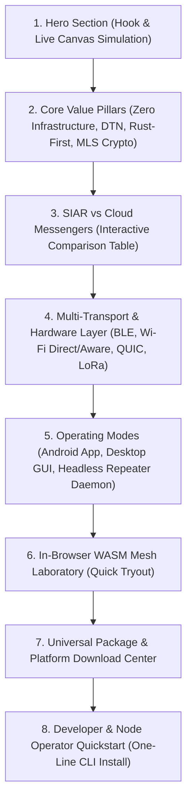
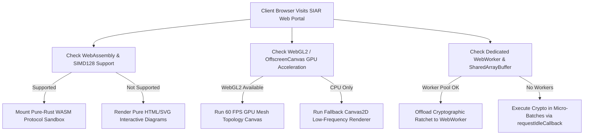

# Part I: Product Showcase & Landing UI/UX Architecture

## 1. Overview & Showcase Vision

The **SIAR Official Showcase Website** is the primary visual, architectural, and educational gateway to the SIAR ecosystem. It is designed to immediately articulate SIAR’s fundamental paradigm shift: **communication that survives without internet infrastructure, cellular towers, servers, or centralized gatekeepers**.

```
+-----------------------------------------------------------------------------------+
|                            SIAR HERO SHOWCASE VIEW                               |
+-----------------------------------------------------------------------------------+
|  [SIAR LOGO]   Features   Ecosystem   Packages   Simulator   Docs   [Get SIAR v0.1] |
|                                                                                   |
|      COMMUNICATION THAT SURVIVES WHEN EVERYTHING ELSE COLLAPSES.                  |
|      Zero-infrastructure, multi-transport, pure-Rust decentralized mesh & DTN.    |
|                                                                                   |
|   +--------------------------+  +-------------------------+                       |
|   |  📥 Download Client      |  |  🧪 Open Mesh Simulator |                       |
|   +--------------------------+  +-------------------------+                       |
|                                                                                   |
|   [ Live Interactive Mesh Node Simulation Canvas: 8 Nodes, 4 Transports Active ]  |
|   ( BLE: 3 links | Wi-Fi Direct: 2 links | QUIC: 1 link | DTN Queue: 14 pkts )    |
+-----------------------------------------------------------------------------------+
```

---

## 2. Information Architecture & Page Structure

The landing experience is organized into 8 structured narrative sections:



### 2.1 Section Breakdown

1. **Hero Section**:
   - High-impact headline: *"Communication that survives when everything else collapses."*
   - Interactive SVG/Canvas node simulator showing real-time peer discovery, multi-hop opportunistic packet bouncing, and physical transport link shifts.
   - Dual Call-To-Action (CTA): `[ Download SIAR ]` (auto-detects user OS) and `[ Open Interactive Mesh Lab ]`.
   - Live network telemetry ticker (Release version, commit hash, reproducible build status, P2P network health).

2. **Core Value Pillars**:
   - **Zero Central Infrastructure**: No identity servers, phone number tracking, or DNS lookups.
   - **Delay-Tolerant Networking (DTN)**: Autonomous store-carry-forward queues that bridge physical air-gaps during blackouts.
   - **Pure-Rust Bare-Metal Engine**: 95%+ unified Rust codebase compiled to native targets and WebAssembly.
   - **Post-Compromise Security**: OpenMLS cryptographic key ratchet with self-sovereign Ed25519 identities.

3. **Interactive Comparison Matrix**:
   - Side-by-side comparative inspector: SIAR vs Signal vs Matrix vs Briar vs Meshtastic.
   - Interactive feature filters: Infrastructure dependencies, bandwidth scaling, hardware codec utilization, battery efficiency, and offline survivability.

4. **Multi-Transport & Hardware Visualizer**:
   - Interactive stack diagram demonstrating how `crates/siar-transport` orchestrates BLE, Wi-Fi Direct, Wi-Fi Aware, Bluetooth Classic, and QUIC.
   - Live packet trace animation showing automated failover when cellular/Wi-Fi drops and BLE mesh engages.

5. **Dual Operating Modes Showcase**:
   - **User Client App**: Showcasing Android Jetpack Compose UI and Dioxus Desktop UI with hardware-accelerated AV1/Opus media streaming.
   - **Headless Repeater Daemon (`siar-emergency-node`)**: Explaining how a $15 Raspberry Pi or portable router operates as an autonomous signal repeater and store-carry-forward bunker.

6. **In-Browser Interactive Playground Teaser**:
   - Embedded sandboxed WASM micro-node enabling visitors to generate a real cryptographic `DeviceIdentity`, construct an MLS message, and simulate multi-hop transport routing in real time.

7. **Universal Download Center**:
   - Dynamic tabbed switcher: Android, Linux, macOS, Windows, Embedded/Docker, CLI & Source.
   - Direct package hashes, GPG/Minisign badges, and one-click package manager commands (`apt`, `brew`, `cargo`, `winget`, `nix`).

8. **Developer & Operator Quickstart**:
   - Interactive terminal snippet with one-line installation, Docker compose configuration, and C-ABI/Kotlin integration code.

---

## 3. Visual Design System & Aesthetics

### 3.1 Color Palette & Token Hierarchy

The visual identity uses a **Tactical High-Tech Cybernetic Aesthetic**, built for extreme clarity in both bright field sunlight and battery-saving dark OLED environments.

```css
:root {
  /* Surface Tokens */
  --siar-bg-base: #07090e;
  --siar-bg-surface: #0e121b;
  --siar-bg-surface-elevated: #151b27;
  --siar-bg-glass: rgba(14, 18, 27, 0.75);

  /* Primary Brand Accents */
  --siar-cyan-glow: #00f2fe;
  --siar-cyan-subtle: #4facfe;
  --siar-emerald-online: #10b981;
  --siar-amber-warning: #f59e0b;
  --siar-rose-critical: #f43f5e;
  --siar-violet-crypto: #8b5cf6;

  /* Typography Colors */
  --siar-text-primary: #f8fafc;
  --siar-text-secondary: #94a3b8;
  --siar-text-muted: #64748b;
  --siar-border-subtle: rgba(255, 255, 255, 0.08);
  --siar-border-active: rgba(0, 242, 254, 0.4);
}

/* OLED Pure-Black Battery-Saving Theme */
[data-theme="oled"] {
  --siar-bg-base: #000000;
  --siar-bg-surface: #050505;
  --siar-bg-surface-elevated: #0a0a0a;
  --siar-bg-glass: rgba(0, 0, 0, 0.85);
  --siar-border-subtle: rgba(255, 255, 255, 0.12);
}
```

### 3.2 Typography Tokens

```css
/* Typography Scale */
--font-sans: 'Inter', -apple-system, BlinkMacSystemFont, 'Segoe UI', Roboto, sans-serif;
--font-mono: 'JetBrains Mono', 'Fira Code', ui-monospace, monospace;
--font-display: 'Outfit', 'Inter', sans-serif;
```

- **Headers & Display**: `Outfit` font with bold tracking for tactical military/scientific authority.
- **Body & Longform Specs**: `Inter` for optimal legibility at small sizes.
- **Code & Network Packets**: `JetBrains Mono` with ligature support for cryptographic hashes and binary framing.

### 3.3 Glassmorphism & Micro-Interactions

```css
.siar-glass-card {
  background: var(--siar-bg-glass);
  backdrop-filter: blur(16px) saturate(180%);
  -webkit-backdrop-filter: blur(16px) saturate(180%);
  border: 1px solid var(--siar-border-subtle);
  border-radius: 12px;
  transition: transform 0.2s cubic-bezier(0.16, 1, 0.3, 1),
              border-color 0.2s ease,
              box-shadow 0.2s ease;
}

.siar-glass-card:hover {
  transform: translateY(-2px);
  border-color: var(--siar-border-active);
  box-shadow: 0 12px 32px -8px rgba(0, 242, 254, 0.15);
}
```

---

## 4. Hardware Capability Detection & Progressive Enhancement

To provide seamless operation across diverse client environments (from high-end desktop workstations to low-spec field smartphones):



---

## 5. Interactive Visual Hero Simulation Canvas

The hero section features an interactive, GPU-accelerated HTML5 Canvas / WebGL component that runs a simulated multi-node mesh topology directly on the client.

```
       [Node Alpha] <--- (BLE Link: 1.2 Mbps, RSSI: -65dBm) ---> [Node Beta]
            \                                                       /
 (Wi-Fi Direct: 48 Mbps)                                 (DTN Queue: 4 Bundles)
              \                                                   /
               +-------------> [Emergency Repeater] <------------+
                                      |
                           (QUIC Link: Internet Uplink)
                                      v
                                [Node Gamma]
```

### 5.1 Simulation Engine Architecture

```javascript
// GPU-Accelerated Canvas Mesh Node Simulator Engine
class MeshVisualizer {
  constructor(canvasElement) {
    this.canvas = canvasElement;
    this.ctx = canvasElement.getContext('2d');
    this.nodes = [];
    this.packets = [];
    this.transports = ['BLE', 'WIFI_DIRECT', 'WIFI_AWARE', 'QUIC'];
    this.initTopology();
  }

  initTopology() {
    for (let i = 0; i < 7; i++) {
      this.nodes.push({
        id: `node-${i}`,
        type: i === 0 ? 'EMERGENCY_REPEATER' : 'MOBILE_CLIENT',
        x: Math.random() * this.canvas.width,
        y: Math.random() * this.canvas.height,
        vx: (Math.random() - 0.5) * 0.4,
        vy: (Math.random() - 0.5) * 0.4,
        range: i === 0 ? 220 : 140,
        battery: 80 + Math.random() * 20
      });
    }
  }

  spawnPacket(sourceNode, targetNode, transportType) {
    this.packets.push({
      source: sourceNode,
      target: targetNode,
      progress: 0.0,
      transport: transportType,
      encrypted: true
    });
  }

  render() {
    this.ctx.clearRect(0, 0, this.canvas.width, this.canvas.height);
    this.updateNodes();
    this.drawLinks();
    this.drawPackets();
    this.drawNodes();
    requestAnimationFrame(() => this.render());
  }
}
```

---

## 6. Performance, Accessibility & SEO Architecture

### 6.1 Sub-Second Core Web Vitals Targets

| Metric | Target | Optimization Strategy |
| :--- | :--- | :--- |
| **LCP (Largest Contentful Paint)** | `< 0.6s` | Inline critical CSS, pre-rendered static HTML, zero blocking JavaScript on initial paint. |
| **FID / INP (Interaction to Next Paint)**| `< 40ms` | WASM engine and canvas simulations execute in dedicated WebWorkers. |
| **CLS (Cumulative Layout Shift)** | `0.00` | Hardcoded container aspect ratios, font font-display: optional, pre-allocated layout slots. |
| **Total Bundle Weight (Initial)** | `< 65KB` gzipped | Zero heavy frameworks on initial HTML; vanilla CSS tokens + Astro/Svelte islands. |

### 6.2 Accessibility & Inclusive Controls

- **WCAG 2.1 AAA Contrast**: All text elements maintain a minimum contrast ratio of `7:1` against dark surfaces.
- **OLED Pure-Black Mode**: System preference query `prefers-color-scheme: dark` activates zero-emission `#000000` backgrounds for battery longevity on mobile OLED screens.
- **Reduced Motion Mode**: When `prefers-reduced-motion: reduce` is active, particle simulations and auto-looping canvas animations freeze into clear static topology diagrams.
- **Full Screen-Reader ARIA Architecture**: Dynamic visual states (e.g., node link establishment, package checksum verification) are announced via `aria-live="polite"` regions.

### 6.3 Internationalization (i18n) Engine

- **Supported Initial Locales**: English (`en`), Spanish (`es`), Ukrainian (`uk`), Arabic (`ar` with native RTL layout flipping), German (`de`), and Simplified Chinese (`zh-CN`).
- **Static Pre-Rendering**: Every locale is statically built to dedicated URL paths (e.g., `siar.irshad.org.in/ar/`, `siar.irshad.org.in/uk/`) with zero client-side hydration delays.
