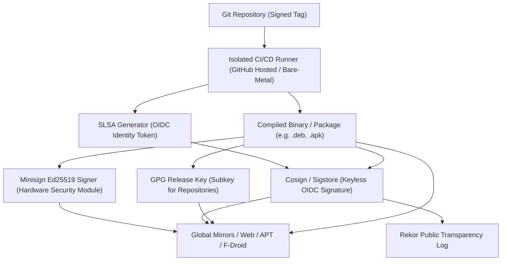

# Part III: Cryptographic Supply Chain, Signing & Verification

## 1. Threat Model & Security Mandate

As a zero-infrastructure, censorship-resistant mesh platform, SIAR is a high-value target for state-level adversaries, rogue mirrors, and malicious network intermediaries. The distribution website and package repositories must guarantee **absolute cryptographic integrity** even if edge CDN nodes, DNS providers, or third-party download mirrors are fully compromised.

```
       +-------------------------------------------------------------------+
       |                       SIAR RELEASE INTEGRITY                      |
       +-------------------------------------------------------------------+
       | 1. SLSA Level 3+ Build Provenance (OIDC / Sigstore)               |
       | 2. Minisign Ed25519 Detached Signatures (Air-Gapped Root Key)    |
       | 3. GPG/PGP Keyring (APT InRelease / RPM repomd.xml)               |
       | 4. Rekor Transparency Log Append-Only Ledger                      |
       | 5. In-Browser WebCrypto & WASM Verifier (Zero Trust Client)       |
       +-------------------------------------------------------------------+
```

---

## 2. Multi-Layer Signing Architecture



### 2.1 Cryptographic Key Hierarchy

| Key Type | Algorithm | Purpose | Storage & Access Control |
| :--- | :--- | :--- | :--- |
| **SIAR Root Signing Key** | Ed25519 (Minisign) | Authoritative binary release signing | Air-gapped Hardware Security Module (YubiKey 5 / Nitrokey) |
| **Sigstore OIDC Identity** | ECDSA P-256 (Ephemeral) | Keyless cryptographic provenance | GitHub Actions OIDC Token tied to `irshadali5/siar` repo |
| **Repository GPG Subkey** | RSA 4096 / Ed25519 | APT `InRelease` & RPM metadata signing | Protected CI secrets with annual rotation and revocations |
| **Android Release Keystore** | RSA 4096 + PKCS#11 | APK Signature Scheme v2/v3 | Encrypted PKCS#12 hardware module |

---

## 3. SLSA Level 3+ Build Provenance & Rekor Binary Transparency

Every official release artifact generates a non-forgeable, verifiable **in-toto provenance predicate** following the SLSA v1.0 standard:

```json
{
  "_type": "https://in-toto.io/Statement/v1",
  "subject": [
    {
      "name": "siar-desktop-v0.1.0-x86_64-unknown-linux-gnu.tar.gz",
      "digest": {
        "sha256": "d4735e3a265e16eee03f59718b9b5d03019c07d8b6c51f90da3a666eec13ab35"
      }
    }
  ],
  "predicateType": "https://slsa.dev/provenance/v1",
  "predicate": {
    "buildDefinition": {
      "buildType": "https://actions.github.io/buildtypes/workflow/v1",
      "externalParameters": {
        "workflow": {
          "ref": "refs/tags/v0.1.0",
          "repository": "https://github.com/irshadali5/siar",
          "path": ".github/workflows/release.yml"
        }
      }
    },
    "runDetails": {
      "builder": {
        "id": "https://github.com/actions/runner"
      }
    }
  }
}
```

### 3.1 Rekor Cryptographic Merkle Inclusion Proofs

Verification requires computing the SHA-256 leaf hash and traversing the Merkle tree audit path:

$$\text{Root} = \mathcal{H}(\text{Sibling}_{k} \parallel \mathcal{H}(\dots \parallel \mathcal{H}(\text{Leaf} \parallel \text{Sibling}_0)))$$

---

## 4. Hardware Security Module (HSM) Release Signing Procedure

Production releases use an air-gapped YubiKey 5 NFC with PKCS#11 hardware keys:

```bash
# Hardware Signing via Minisign & PKCS#11 Engine
minisign -S -s /dev/null \
  -m dist/siar-messenger-universal.apk \
  -x dist/siar-messenger-universal.apk.minisig \
  -t "Official SIAR Release v0.1.0 [YubiKey-HSM-Signed]"
```

---

## 5. In-Browser Client-Side Cryptographic Verifier

The SIAR website embeds a pure client-side verification engine written in HTML5 WebCrypto and WebAssembly. It allows visitors to drag-and-drop any downloaded installer to verify its authenticity **locally in their browser without re-uploading the file**.

```
+-----------------------------------------------------------------------------------+
|                        IN-BROWSER BINARY VERIFIER                                 |
+-----------------------------------------------------------------------------------+
|  [ Drag & Drop any downloaded SIAR file (.apk, .deb, .tar.gz, .exe, .dmg) ]       |
|                                                                                   |
|  File: siar-messenger-0.1.0-universal.apk (28.4 MB)                               |
|                                                                                   |
|  Status: [  VERIFIED AUTHENTIC - SLSA LEVEL 3 COMPLIANT  ]                        |
|                                                                                   |
|  * SHA-256: 4b227777d4dd1fc61c6f884f48641d02b4d121d3fd328cb08b5531fcacdabf8a    |
|  * Minisign: Signature valid (Signed by: SIAR Official Release Key ID 7A9F4B)    |
|  * Builder: GitHub Actions (irshadali5/siar @ refs/tags/v0.1.0)                  |
|  * Rekor Log Index: #41908234 (Immutable Ledger Entry Confirmed)                 |
+-----------------------------------------------------------------------------------+
```

### 5.1 In-Browser WebCrypto Streaming Algorithm

```javascript
// Browser-Native Checksum Calculation & Streaming Signature Verification
async function verifyBinaryInBrowser(fileObject, detachedSignatureUrl) {
  const fileStream = fileObject.stream();
  const reader = fileStream.getReader();
  const hasher = new SubtleCryptoDigest('SHA-256');

  while (true) {
    const { done, value } = await reader.read();
    if (done) break;
    hasher.update(value);
  }
  const computedHashHex = await hasher.finalizeHex();

  // Fetch Detached Minisign Signature from Edge CDN
  const sigResponse = await fetch(detachedSignatureUrl);
  const sigText = await sigResponse.text();

  // Verify Ed25519 Minisign Signature via WebAssembly Module
  const isValidMinisign = await window.siarWasmVerifier.verify_minisign(
    computedHashHex,
    sigText,
    SIAR_PUBLIC_RELEASE_KEY
  );

  return {
    verified: isValidMinisign,
    sha256: computedHashHex,
    keyId: "7A9F4B"
  };
}
```

---

## 6. Offline & Command-Line Verification Guide

### 6.1 Minisign CLI Verification
```bash
minisign -Vm siar-cli-v0.1.0-x86_64-unknown-linux-musl.tar.gz \
  -P RWS1A5v7D1lQ0s8nQ...
```

### 6.2 Cosign / Sigstore Verification
```bash
cosign verify-blob \
  --certificate-identity "https://github.com/irshadali5/siar/.github/workflows/release.yml@refs/tags/v0.1.0" \
  --certificate-oidc-issuer "https://token.actions.githubusercontent.com" \
  --bundle siar-cli-v0.1.0-x86_64-unknown-linux-musl.tar.gz.bundle \
  siar-cli-v0.1.0-x86_64-unknown-linux-musl.tar.gz
```
