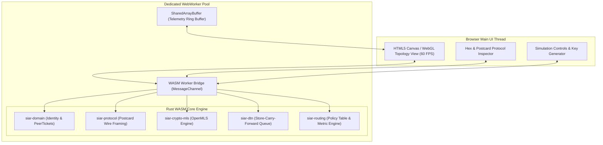

# Part IV: In-Browser WASM Simulator & Protocol Playground

## 1. Overview & Architectural Goal

The **SIAR Interactive WASM Playground** embeds genuine SIAR protocol, cryptography, and routing logic directly inside the web browser. Compiled from SIAR’s pure-Rust core crates (`siar-protocol`, `siar-crypto-mls`, `siar-dtn-bundle`, and `siar-routing-policy`) to `wasm32-unknown-unknown`, it allows developers, evaluators, and students to **test, visualize, and interact with live SIAR nodes without installing any software**.

```
+-----------------------------------------------------------------------------------------+
|                        SIAR BROWSER MESH LABORATORY & SIMULATOR                         |
+-----------------------------------------------------------------------------------------+
| [ Top Bar: Preset Scenarios: (1) Off-Grid Disaster | (2) MLS Group Ratchet | (3) DTN ]  |
|                                                                                         |
|  +-- Node Topology Canvas --------------------+  +-- Live Postcard Wire Inspector ----+ |
|  |                                            |  | Packet: DTN_BUNDLE_V1 (0x81)       | |
|  |  (Alice) ---[BLE: 2m]--- (Repeater-1)      |  | Source: ed25519:7a4f...            | |
|  |                             |              |  | Dest:   ed25519:9b12...            | |
|  |                        [Air Gap]           |  | TTL:    48 Hours (DTN Forwarding)  | |
|  |                             |              |  | Payload: Encrypted (ChaCha20-Poly) | |
|  |                         (Bob: Offline)     |  | MLS Epoch: 3 (Post-Compromise OK)  | |
|  |                                            |  | Hex: 81 04 2a f9 02 ... [Decode]   | |
|  +--------------------------------------------+  +------------------------------------+ |
|                                                                                         |
|  [ Play / Step Simulation ] [ Trigger Link Drop ] [ Send Emergency Broadcast ]          |
+-----------------------------------------------------------------------------------------+
```

---

## 2. WebAssembly Client Architecture & WebWorker Pipeline



### 2.1 SharedArrayBuffer Ring Buffer Specification

To prevent GC stutters on the 60 FPS animation canvas, node metrics are written into a 64KB shared memory ring buffer:

```rust
// In-Memory Shared Buffer Layout (Rust WASM Side)
#[repr(C)]
pub struct NodeTelemetrySlot {
    pub node_id: u32,
    pub pos_x_fixed: i16,      // 12.4 fixed point
    pub pos_y_fixed: i16,
    pub battery_percent: u8,
    pub dtn_queue_len: u8,
    pub active_links_mask: u16, // Bit 0: BLE, Bit 1: WiFi, Bit 2: LoRa
    pub tx_bytes_sec: u32,
    pub rx_bytes_sec: u32,
}
```

---

## 3. Core Simulation Capabilities & Modules

### 3.1 Simulated Virtual Network Layer

```rust
#[derive(Serialize, Deserialize)]
pub struct SimulatedNode {
    pub node_id: DeviceId,
    pub identity: DeviceIdentity,
    pub node_type: NodeType, // Mobile, Repeater, Desktop, SolarGateway
    pub position: (f32, f32),
    pub battery_level: f32,
    pub dtn_queue: Vec<DtnBundle>,
    pub routing_table: PathTable,
    pub link_interfaces: Vec<SimulatedInterface>,
}

#[derive(Serialize, Deserialize)]
pub struct SimulatedInterface {
    pub interface_type: TransportType, // Ble, WifiDirect, WifiAware, Quic, LoRa
    pub range_meters: f32,
    pub rssi_dbm: i8,
    pub packet_loss_rate: f32,
    pub bandwidth_kbps: u32,
}
```

### 3.2 Key Interactive Scenarios

1. **The Off-Grid Disaster DTN Bridge**:
   - Node A (Emergency Shelter) has no internet.
   - Node B (Disaster Patrol Vehicle) drives between Shelter and Base Camp.
   - User watches bundles move into Node B's memory buffer, travel across the air-gap, and drain into Node C upon proximity handshake.

2. **MLS Group Ratchet & Post-Compromise Security**:
   - User creates a 3-member group.
   - Simulates a compromised device state at Epoch 1.
   - Member performs a self-update; user verifies in real-time that all future Epoch 2+ messages become cryptographically unreadable to the compromised state.

3. **Multi-Transport Path Fallback**:
   - Simulates active QUIC Internet connection.
   - User clicks "Cut Central Internet Cable".
   - Watch the policy engine automatically fall back to Wi-Fi Direct and BLE mesh without dropping the chat session.

---

## 4. Live Protocol Wire & Postcard Decoder

The simulator includes a real-time binary inspector that decodes raw Postcard-serialized buffers into structured, syntax-highlighted protocol objects:

```
[ Raw Hex Dump ]
0000: 02 01 20 7a 4f b9 18 cc  3d a1 0e f4 9b 12 77 41  .. zO..=.....wA
0010: 10 03 84 e9 01 c0 34 1a  88 ff 12 bc 90 22 10 01  ......4......"..

[ Postcard Protocol AST ]
Frame: TransportFrame::DataBundle {
  header: FrameHeader {
    version: 1,
    flags: 0x02 (PRIORITY_EMERGENCY | E2EE_MLS),
    source: "ed25519:7a4fb918cc3da10ef49b127741...",
    destination: "ed25519:9b1288ff12bc90221001...",
    timestamp_epoch_ms: 1787968800000,
    hop_count: 2,
    max_hops: 8
  },
  payload: EncryptedPayload::MLS {
    epoch: 3,
    generation: 14,
    ciphertext_len: 256,
    auth_tag: "c0341a88ff12bc90221001"
  }
}
```

---

## 5. WebRTC / WebSocket Local Node Bridge

The browser playground can connect directly to a live `siar-cli` or `siar-desktop` instance running on the user’s local machine:

```
[ In-Browser WASM Node ] <--- (Local WebSocket: ws://127.0.0.1:9443) ---> [ Native Desktop SIAR ]
```
