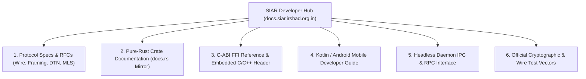

# Part V: Developer Portal, Interactive Specs & SDK Hub

## 1. Overview & Developer Experience

The **SIAR Developer Portal & SDK Hub** provides comprehensive, searchable, interactive technical documentation, API references, test vectors, and multi-language client SDKs for engineers building on or integrating with SIAR.

```
+-----------------------------------------------------------------------------------+
|                        SIAR DEVELOPER & PROTOCOL PORTAL                           |
+-----------------------------------------------------------------------------------+
|  [ SEARCH DOCS & APIS...                                                      Q ] |
|                                                                                   |
|  * Protocol Specifications: Postcard Wire Framing | Capability Negotiation       |
|  * Rust API Docs: siar-crypto | siar-transport | siar-dtn | siar-storage          |
|  * C-ABI FFI Header Reference: siar_core.h | Memory Models & Thread Safety       |
|  * Mobile SDKs: Android Jetpack Compose | Kotlin JNI Bindings                     |
|  * Headless Node RPC: Control Socket (IPC) | JSON-RPC & gRPC Schema Explorer      |
|  * Cryptographic Test Vectors: Ed25519 | MLS Group Handshake | DTN Serialization   |
+-----------------------------------------------------------------------------------+
```

---

## 2. Information Hierarchy & Portal Architecture



---

## 3. Interactive Protocol Wire Specification Viewer

```rust
/// Canonical Wire Envelope for SIAR Mesh & DTN Transport
#[repr(u8)]
pub enum FrameType {
    Handshake = 0x01,
    RouteDiscovery = 0x02,
    DataBundle = 0x03,
    Ack = 0x04,
    EmergencyAlert = 0x0F,
}

#[derive(Serialize, Deserialize, Debug, Clone)]
pub struct WireHeader {
    pub magic: [u8; 4],             // b"SIAR" (0x53, 0x49, 0x41, 0x52)
    pub protocol_version: u16,      // Current: 1
    pub frame_type: FrameType,
    pub flags: u8,                  // Bit 0: Encrypted, Bit 1: DTN Forwardable, Bit 2: SOS
    pub source_id: [u8; 32],        // Ed25519 Public Key
    pub destination_id: [u8; 32],   // Ed25519 Public Key
    pub sequence_number: u64,
    pub timestamp_ms: u64,
    pub payload_len: u32,
}
```

---

## 4. C-ABI FFI Header & Multi-Language Memory Models

### 4.1 C Header Reference (`include/siar_core.h`)

```c
#ifndef SIAR_CORE_H
#define SIAR_CORE_H

#include <stdint.h>
#include <stdbool.h>

#ifdef __cplusplus
extern "C" {
#endif

typedef struct SiarNodeHandle SiarNodeHandle;
typedef struct SiarPeerTicket SiarPeerTicket;

/**
 * Initialize a new SIAR embedded node instance.
 *
 * @param storage_path Null-terminated path to persistent state directory.
 * @param out_handle Pointer to store the allocated node handle.
 * @return 0 on success, negative error code on failure.
 */
int32_t siar_node_init(const char* storage_path, SiarNodeHandle** out_handle);

/**
 * Send an end-to-end encrypted message bundle.
 */
int32_t siar_node_send_message(
    SiarNodeHandle* handle,
    const uint8_t* destination_pubkey_32,
    const uint8_t* payload_bytes,
    uint32_t payload_len,
    uint32_t priority_class
);

/**
 * Free resources associated with a node handle.
 */
void siar_node_destroy(SiarNodeHandle* handle);

#ifdef __cplusplus
}
#endif

#endif // SIAR_CORE_H
```

### 4.2 Memory Allocation & Ownership Rules

1. **Host-Allocated Inbound Buffers**: Pointers passed into `siar_node_send_message` are borrowed for the duration of the synchronous call. Rust never frees memory allocated by C/C++.
2. **Rust-Allocated Outbound Strings**: Strings returned by `siar_get_error_message` must be released using `siar_free_string(char* ptr)` to ensure the allocator matches.

---

## 5. Multi-Language Code Snippet Generator

```kotlin
// Android Kotlin Native Integration
val siarEngine = SiarEngine.create(
    context = applicationContext,
    config = SiarConfig.Builder()
        .enableBleMesh(true)
        .enableWifiDirect(true)
        .setDtnStorageQuotaMb(500)
        .build()
)

siarEngine.messages.collect { message ->
    Log.d("SIAR", "Received message from: ${message.senderId} via ${message.transportType}")
}
```

```python
# Python Automation via Unix Domain Socket
import socket, json

sock = socket.socket(socket.AF_UNIX, socket.SOCK_STREAM)
sock.connect("/var/run/siar/siar-node.sock")

rpc_command = {
    "jsonrpc": "2.0",
    "method": "get_active_routes",
    "params": {"include_dtn_queue": True},
    "id": 1
}
sock.sendall(json.dumps(rpc_command).encode('utf-8') + b'\n')
response = json.loads(sock.recv(4096).decode('utf-8'))
print(f"Active Mesh Neighbors: {len(response['result']['neighbors'])}")
```

---

## 6. Official Test Vector Suite

To ensure third-party implementations conform to the SIAR protocol specification, the hub provides downloadable, versioned JSON test vectors:

- `crypto_ed25519_sign_verify.json`: 500 test cases for identity verification.
- `crypto_mls_group_ratchet.json`: Multi-party tree ratchet state transition vectors.
- `dtn_bundle_fragmentation.json`: Chunking, reassembly, and checksum validation vectors.
- `postcard_wire_framing.json`: Raw byte arrays and corresponding decoded AST trees.
