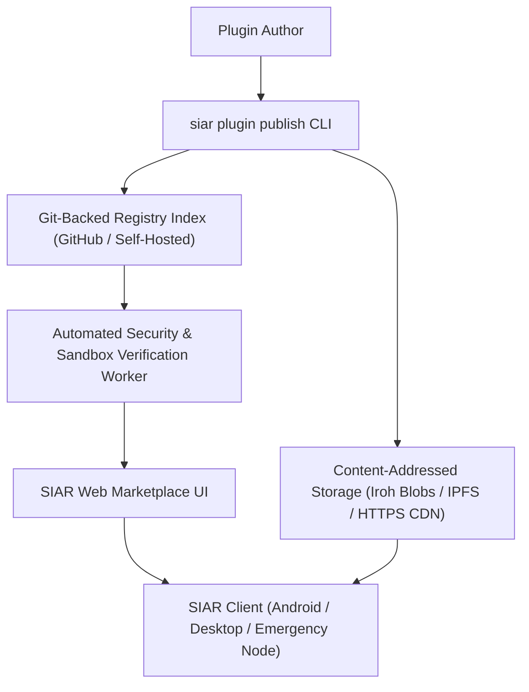

# Part VI: Decentralized Plugin Marketplace & Extension Registry

## 1. Overview & Ecosystem Vision

The **SIAR Plugin & Extension Registry** is a decentralized, cryptographically verified catalog for third-party extensions, custom hardware transport drivers (e.g., LoRa SX1262, Iridium SBD satellite adapters, APRS/AX.25 packet radio), off-grid map tile caches, and automated emergency bot scripts.

```
+-----------------------------------------------------------------------------------------+
|                        SIAR PLUGIN & PROTOCOL EXTENSION REGISTRY                        |
+-----------------------------------------------------------------------------------------+
| [ Search Plugins: "LoRa Transport", "Disaster Map Tiles", "Sensor Telemetry"...     Q ]|
|                                                                                         |
|  +-- FEATURED VERIFIED EXTENSIONS ----------------------------------------------------+ |
|  | [📦] lora-sx1262-driver         v1.2.0 | ⭐ 4.9 | 🛡️ Verified WASI Sandbox       | |
|  |     Adds 915MHz/868MHz long-range mesh packet modulation to SIAR daemons.          | |
|  |     Permissions: [Hardware SPI, GPIO] | Audit: Passed (Zero Network Escape)        | |
|  |     Install: $ siar plugin install lora-sx1262-driver                       [Copy] | |
|  +------------------------------------------------------------------------------------+ |
|  | [📦] offline-topomap-tiles      v0.4.1 | ⭐ 4.8 | 🛡️ Data Bundle                  | |
|  |     OpenStreetMap terrain vector tiles for off-grid search and rescue operations.  | |
|  +------------------------------------------------------------------------------------+ |
+-----------------------------------------------------------------------------------------+
```

---

## 2. Registry Architecture & Decentralized Storage Topology



### 2.1 Content-Addressed Immutability
All plugin packages are identified by their cryptographic content digest (BLAKE3 hash). Once published, an artifact cannot be modified or replaced, preventing supply-chain substitution attacks.

---

## 3. Plugin Manifest Specification (`siar-plugin.toml`)

```toml
[plugin]
name = "siar-transport-lora-sx1262"
version = "1.2.0"
edition = "2024"
authors = ["Irshad Ali <dev@siar.irshad.org.in>"]
description = "LoRa SX1262 hardware transport driver for long-range emergency mesh"
license = "MIT OR Apache-2.0"
homepage = "https://github.com/irshadali5/siar-lora"
repository = "https://github.com/irshadali5/siar-lora"
keywords = ["lora", "hardware", "transport", "emergency"]
category = "transports"

[runtime]
engine = "wasm32-wasi"
entrypoint = "siar_lora_sx1262.wasm"
abi_version = 1
max_memory_mb = 16
cpu_time_limit_ms = 50

[capabilities]
# Explicit permission model enforced by Wasmtime sandbox
hardware_spi = true
hardware_gpio = [4, 17, 27]  # CS, Reset, Busy pins
network_raw_sockets = false   # Prevent internet exfiltration
local_storage_kv = true       # Store frequency & spread factor config
```

---

## 4. WASI Sandboxing & Fuel Gas-Metering Engine

Plugins execute inside a heavily restricted **Wasmtime** WebAssembly runtime:
1. **Memory Isolation**: Each plugin is assigned a hard memory ceiling (`max_memory_mb = 16`). Attempts to allocate beyond the limit trigger an instant trap.
2. **CPU Fuel Metering**: Wasmtime consumes fuel units per instruction. Infinite loops or cryptographic traps exhaust fuel and abort cleanly within `< 50ms`.
3. **Capability Broker**: Hardware interfaces (GPIO, SPI, Serial) are virtualized through a capability-broker host trait, preventing arbitrary host system access.

---

## 5. Automated Security Vetting Pipeline

```
[ New Plugin Submission ]
            |
            v
1. [ WASM Bytecode Disassembly & Static Analysis ]
   - Validate strict WASI capability conformance.
   - Detect forbidden syscalls (e.g. host filesystem traversal, exec, fork).
            |
            v
2. [ Memory & Determinism Verification ]
   - Verify deterministic execution under memory limits.
   - Ensure zero floating-point nondeterminism in cryptographic paths.
            |
            v
3. [ Cryptographic Signature Validation ]
   - Verify developer's Ed25519 signing key against known author identity.
            |
            v
[ Publish to Index & Badge with "🛡️ Verified Sandbox" ]
```

---

## 6. Developer Publishing CLI Workflow

```bash
# 1. Initialize a new plugin workspace
siar plugin new my-custom-extension --type transport

# 2. Build WebAssembly release binary
cargo build --target wasm32-wasi --release

# 3. Test plugin inside local sandboxed runner
siar plugin test --manifest siar-plugin.toml

# 4. Sign and publish to official registry
siar plugin publish --key ~/.siar/dev-signing-key.pem
```
