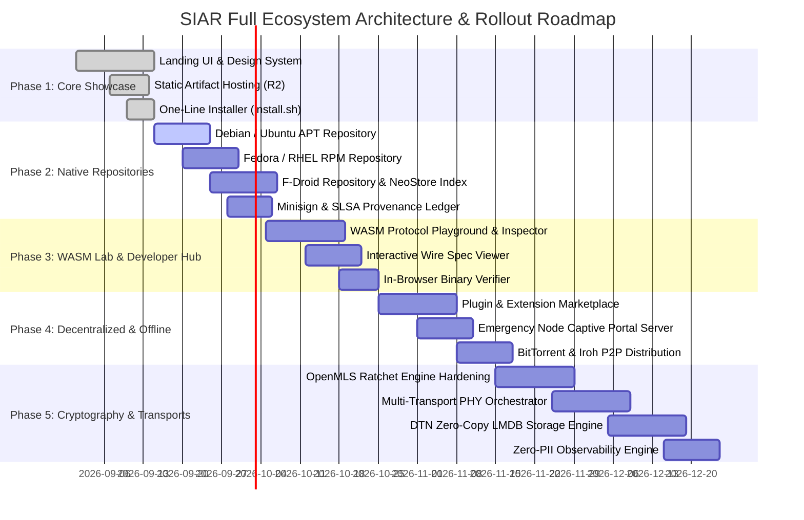

# Part X: System Requirements, Tech Stack & Implementation Roadmap

## 1. Comprehensive System Requirements

To build, deploy, and maintain the SIAR Web Showcase, Universal Package Distribution System, and Developer Hub, the following infrastructure, software, and operational resources are required:

### 1.1 Infrastructure & Hosting Requirements

| Component | Minimum Specification | Recommended Production Setup |
| :--- | :--- | :--- |
| **Primary Edge CDN** | Cloudflare Free / Standard | Cloudflare Enterprise / Pro with Anycast DNS & Edge Workers |
| **Object Storage (Origin)** | 100 GB S3 Compatible | Cloudflare R2 (Primary, Zero Egress) + 1 TB MinIO EU Replica |
| **Bandwidth Capacity** | 5 TB / month | 25+ TB / month (Mitigated by P2P BitTorrent Web Seeds) |
| **CI/CD Build Matrix** | 4-Core x86_64 VM | 32-Core Bare-Metal Dedicated Runner (Linux x86_64 + ARM64) |
| **Domain & DNS** | Root domain (`siar.irshad.org.in`) | DNSSEC enabled, Cloudflare Anycast, CAA & HSTS preloaded |

---

## 2. Definitive Technology Stack

```
+-----------------------------------------------------------------------------------+
|                        SIAR SITE & PLATFORM TECH STACK                            |
+-----------------------------------------------------------------------------------+
|  * Frontend Framework: Astro + Vanilla CSS / Tailwind (Zero-JS Static Core)      |
|  * Interactive Islands: Preact / Svelte + HTML5 WebGL / Canvas                   |
|  * Browser WASM Engine: Rust (siar-protocol, siar-crypto-mls) via wasm-bindgen    |
|  * Edge Compute: Cloudflare Workers (TypeScript / Rust Wasm)                      |
|  * Package Indexing: reprepro (Debian), createrepo_c (RPM), fdroidserver (Android)|
|  * Signing & Security: Minisign (Ed25519), Sigstore / Cosign, GPG, Rekor          |
|  * Documentation Generator: mdBook + Starlight / Astro Content Collections        |
|  * P2P Distribution: WebTorrent, BitTorrent v2, Iroh P2P Blobs                    |
+-----------------------------------------------------------------------------------+
```

---

## 3. Web & Edge Security Configuration

```http
Strict-Transport-Security: max-age=63072000; includeSubDomains; preload
X-Content-Type-Options: nosniff
X-Frame-Options: DENY
Referrer-Policy: strict-origin-when-cross-origin
Cross-Origin-Embedder-Policy: require-corp
Cross-Origin-Opener-Policy: same-origin
Content-Security-Policy: default-src 'none'; script-src 'self' 'wasm-unsafe-eval'; style-src 'self' 'unsafe-inline'; img-src 'self' data: https://pkg.siar.irshad.org.in; connect-src 'self' https://pkg.siar.irshad.org.in https://download.siar.irshad.org.in wss://*.siar.irshad.org.in; object-src 'none'; base-uri 'none'; form-action 'none';
```

---

## 4. Phase-by-Phase Implementation Roadmap



### Milestone Details:

- **Phase 1: Foundation & Showcase (Days 1–15)**:
  - Deploy Astro-based static site with tactical OLED dark theme, responsive canvas hero mesh simulator, and direct download links from Cloudflare R2.
  - Implement `install.sh` and `install.ps1` fast-bootstrap installer scripts.

- **Phase 2: Verifiable Native Repositories (Days 16–35)**:
  - Deploy official signed APT (`/deb`), RPM (`/rpm`), and F-Droid (`/fdroid`) repositories with automated CI/CD regeneration.
  - Integrate Minisign Ed25519 detached signatures and SLSA Level 3 provenance generator in GitHub Actions.

- **Phase 3: WASM Mesh Laboratory & Developer Hub (Days 36–55)**:
  - Compile `siar-protocol` and `siar-crypto-mls` to WebAssembly with WebWorker sandboxing.
  - Build the interactive mesh simulation canvas and live Postcard binary frame decoder.
  - Launch the Developer Portal with complete Rustdoc mirrors, C-ABI headers, and multi-language snippets.

- **Phase 4: Ecosystem, Plugins & Offline Survival (Days 56–75)**:
  - Deploy the WASM plugin marketplace with automated static security vetting.
  - Integrate embedded Wi-Fi Captive Portal engine into `crates/siar-emergency` and test on Raspberry Pi.
  - Generate official BitTorrent release swarms and publish Iroh P2P content-addressed release blobs.

- **Phase 5: Advanced Cryptography, Transports & Observability (Days 76–110)**:
  - Formal verification of OpenMLS tree-KEM ratchet state transitions.
  - Hardware testing across BLE 5.4, Wi-Fi Direct, and LoRa SX1262 repeaters.
  - Integration of zero-copy LMDB DTN storage and Prometheus observability exporter.
