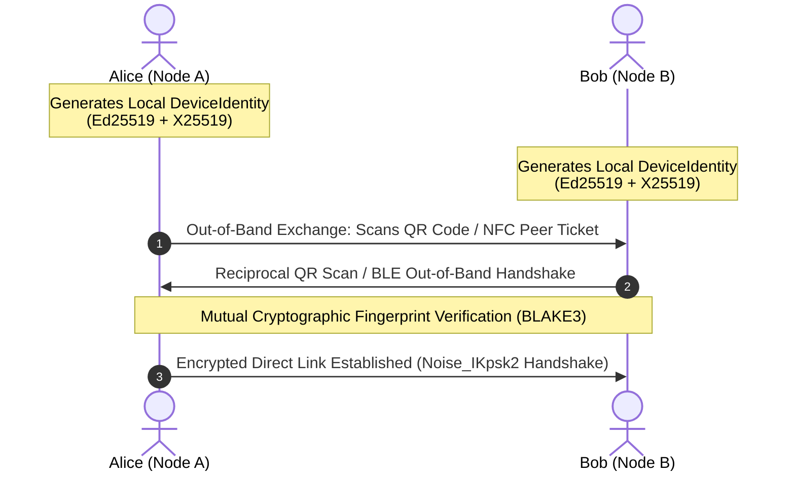

# Part XI: Identity, Cryptographic Trust & OpenMLS Ratchet Engine

## 1. Overview & Identity Philosophy

In traditional centralized messaging platforms, identity is tethered to centralized authorities—phone numbers issued by state-regulated telecoms, email addresses managed by cloud providers, or federated domain names. In disaster scenarios, war zones, or active state censorship, these centralized anchors fail or become attack vectors.

**SIAR rejects all external identity anchors.** Within the SIAR ecosystem, an identity is a **self-sovereign, cryptographically verifiable keypair** generated entirely on the local device, requiring zero cloud registration, zero central coordination, and zero persistent network infrastructure.

```
+-----------------------------------------------------------------------------------+
|                        SIAR CRYPTOGRAPHIC IDENTITY SPECIFICATION                  |
+-----------------------------------------------------------------------------------+
|  1. ROOT SIGNING KEY       | Ed25519 (256-bit Edwards-curve Digital Signature)    |
|  2. EPHEMERAL KEY EXCHANGE | X25519 (Curve25519 Diffie-Hellman Key Agreement)     |
|  3. FINGERPRINT & ADDRESS  | BLAKE3-256 Digest -> Base32 Encoded (`siar1...`)     |
|  4. GROUP MESSAGING ENGINE | OpenMLS RFC 9420 (Tree-KEM Key Ratchet)              |
|  5. SYMMETRIC CIPHER SUITE | ChaCha20-Poly1305 AEAD + HKDF-SHA256                 |
|  6. FORWARD SECRECY (PFS)  | Ratchet Tree Path Key Evolution per Commit           |
|  7. POST-COMPROMISE RECOVERY | Self-Update Commits purge compromised state vectors |
+-----------------------------------------------------------------------------------+
```

---

## 2. Cryptographic Identity Structure & Peer Tickets

### 2.1 Identity Key Architecture

An individual SIAR device generates and persists a single `DeviceIdentity` cryptographic structure:

```rust
use ed25519_dalek::{SigningKey, VerifyingKey};
use x25519_dalek::{StaticSecret, PublicKey as X25519PublicKey};
use zeroize::ZeroizeOnDrop;

/// Sovereign Device Identity persisted in encrypted hardware keystore
#[derive(ZeroizeOnDrop)]
pub struct DeviceIdentity {
    /// Long-term Ed25519 signing private key for identity proofs and message authenticity
    pub signing_key: SigningKey,
    /// Derived X25519 secret for Direct Message (1-to-1) asynchronous key exchange
    pub x25519_secret: StaticSecret,
    /// Self-assigned human-readable display alias (UTF-8, max 32 bytes)
    pub alias: String,
    /// Identity creation timestamp (Unix epoch milliseconds)
    pub created_at_ms: u64,
}

/// Public verifiable counterpart distributed across the mesh
#[derive(Clone, Debug, PartialEq, Eq, Serialize, Deserialize)]
pub struct PublicIdentity {
    /// 32-byte Ed25519 public verifying key
    pub verifying_key: [u8; 32],
    /// 32-byte X25519 public DH key for pairwise channel derivation
    pub x25519_public: [u8; 32],
    /// Display alias (purely advisory)
    pub alias: String,
    /// Cryptographic signature over alias + timestamp + x25519_public
    pub identity_signature: [u8; 64],
}
```

### 2.2 Peer Tickets & Out-of-Band Verification

To initiate secure communication across air-gapped mesh nodes, users exchange **Peer Tickets**. A Peer Ticket encapsulates public keys, supported physical transports, and rendezvous parameters into a compact binary representation encoded as a QR code or NFC payload.



#### Peer Ticket Binary Wire Format (Postcard Encoding):

```
+---------------+----------------+----------------+-----------------+------------------+
| Magic (4B)    | Version (2B)   | Ed25519 PK(32B)| X25519 PK (32B) | Transports (4B)  |
| 0x53 49 41 52 | 0x00 0x01      | Raw PubKey     | Raw PubKey      | Bitmask (BLE/WiFi|
+---------------+----------------+----------------+-----------------+------------------+
| Capabilities  | Alias Len (1B) | Alias (N bytes)| Signature (64B) | Timestamp (8B)   |
| (4 bytes)     | 0x05           | "Alice"        | Ed25519 Sig     | Unix Millis      |
+---------------+----------------+----------------+-----------------+------------------+
```

---

## 3. OpenMLS (RFC 9420) Group Messaging Architecture

For multi-party group communication, disaster coordination channels, and regional broadcast meshes, SIAR implements the **Messaging Layer Security (MLS) protocol (IETF RFC 9420)**.

Unlike legacy pairwise ratchets (Signal Protocol / Double Ratchet) which scale at $O(N^2)$ message complexity for $N$ members in group chats, MLS utilizes a **Tree-Based Key Encapsulation Mechanism (Tree-KEM)** offering $O(\log N)$ scaling for group re-keying and membership modifications.

```mermaid
graph TD
    subgraph MLS Tree-KEM Ratchet Hierarchy (8-Node Mesh Group)
        Root["Root Node Key (Epoch Secret)"]
        Node01["Node 0-1"]
        Node23["Node 2-3"]
        Node45["Node 4-5"]
        Node67["Node 6-7"]

        Leaf0["Leaf 0: Alice"]
        Leaf1["Leaf 1: Bob"]
        Leaf2["Leaf 2: Charlie"]
        Leaf3["Leaf 3: Dave"]
        Leaf4["Leaf 4: Emergency Base"]
        Leaf5["Leaf 5: Field Medic 1"]
        Leaf6["Leaf 6: Search Drone"]
        Leaf7["Leaf 7: Logistics Depot"]

        Root --> Node01
        Root --> Node23
        Root --> Node45
        Root --> Node67

        Node01 --> Leaf0
        Node01 --> Leaf1
        Node23 --> Leaf2
        Node23 --> Leaf3
        Node45 --> Leaf4
        Node45 --> Leaf5
        Node67 --> Leaf6
        Node67 --> Leaf7
    end
```

### 3.1 MLS Key Evolution & Ratchet Tree State

In SIAR, every MLS Group is governed by an epoch-based key schedule:

1. **Epoch Secret ($E_k$)**: Derived at every group state transition (member added, member removed, or periodic self-update).
2. **Application Secret ($A_k$)**: Used with HKDF-Expand-Label to derive the sender encryption keys and ChaCha20-Poly1305 nonces for chat packets.
3. **Confirmation Tag**: Verifies that all members have converged to the exact same cryptographic tree state.

```rust
pub struct MlsGroupState {
    pub group_id: [u8; 32],
    pub epoch: u64,
    pub tree_kem: TreeKemState,
    pub interim_transcript_hash: [u8; 32],
    pub confirmed_transcript_hash: [u8; 32],
    pub roster: HashMap<LeafIndex, PublicIdentity>,
}

impl MlsGroupState {
    /// Execute a self-update commit to achieve Post-Compromise Security (PCS)
    pub fn self_update(&mut self, my_leaf: LeafIndex) -> Result<(MlsCommit, [u8; 32]), MlsError> {
        let (new_leaf_secret, new_leaf_keypair) = generate_fresh_kem_key();
        let path_secrets = self.tree_kem.update_path(my_leaf, new_leaf_keypair)?;
        let commit = MlsCommit::new(self.epoch + 1, my_leaf, path_secrets);
        self.advance_epoch(&commit)?;
        Ok((commit, self.tree_kem.root_secret()))
    }
}
```

### 3.2 Post-Compromise Security (PCS) & Forward Secrecy (PFS)

- **Perfect Forward Secrecy (PFS)**: Once an epoch advances, previous epoch encryption keys are permanently erased from memory (`zeroize`). Even if an adversary captures physical flash storage from a node, historical messages cannot be decrypted.
- **Post-Compromise Security (PCS)**: If an adversary temporarily extracts ephemeral memory from a node, the legitimate user’s next self-update commit generates a fresh path secret up to the root, permanently evicting the adversary from decrypting subsequent epochs.

---

## 4. Asynchronous Direct Messaging (Pairwise Channel Engine)

When communicating 1-to-1 across delay-tolerant multi-hop paths where both nodes may never be online at the same moment:

```
[ Sender: Alice ]
       |
1. Generate Ephemeral Keypair: (e_priv, e_pub)
2. Perform ECDH:
   ss_1 = X25519(e_priv, Bob_Static_Pub)
   ss_2 = X25519(Alice_Static_Priv, Bob_Static_Pub)
3. Derive Master Key via HKDF-Extract & Expand:
   K_session = HKDF-SHA256(ss_1 || ss_2, Salt="SIAR-DM-v1")
4. Encrypt Message Payload with ChaCha20-Poly1305(K_session, Nonce)
5. Sign Envelope with Alice_Ed25519_Priv
       |
       v (Postcard DTN Wire Bundle)
[ Forwarded across 5 Mesh Nodes in DTN Queue ]
       |
       v
[ Receiver: Bob (Powers on 6 hours later) ]
       |
1. Verify Ed25519 Signature using Alice_Public_Key
2. Recompute ECDH:
   ss_1 = X25519(Bob_Static_Priv, e_pub)
   ss_2 = X25519(Bob_Static_Priv, Alice_Static_Pub)
3. Derive K_session = HKDF-SHA256(ss_1 || ss_2, Salt="SIAR-DM-v1")
4. Authenticate & Decrypt ChaCha20-Poly1305 Ciphertext
```

---

## 5. Trust Model, Key Revocation & Anti-Impersonation

### 5.1 Web of Trust (WoT) & Neighbor Endorsements

In the absence of central Certificate Authorities (CAs), SIAR utilizes a localized Web of Trust:
- **Direct Trust**: Scanned in person via QR code or NFC (Trust Level: 1.0).
- **Transitive Trust (2-Hop)**: Endorsed by at least 3 mutually trusted peers (Trust Level: 0.75).
- **Opportunistic Peer**: Discovered over wireless beacon, unverified (Trust Level: 0.1).

### 5.2 Compromised Key Revocation Protocol

When a user's device is stolen or compromised, the user issues a **Cryptographic Revocation Declaration** from their backup recovery phrase:

```rust
#[derive(Serialize, Deserialize)]
pub struct IdentityRevocation {
    /// The public key being revoked
    pub revoked_key: [u8; 32],
    /// Unix timestamp after which all messages signed by revoked_key must be rejected
    pub effective_after_ms: u64,
    /// Reason code: KeyCompromise (1), DeviceLost (2), Superseded (3)
    pub reason_code: u8,
    /// Signature generated by the Pre-generated Revocation Subkey (Ed25519)
    pub revocation_proof_signature: [u8; 64],
}
```

Revocation proofs propagate via DTN epidemic gossip as high-priority bundles (`0x0F`), instantly poisoning the routing and verification caches of all encountered mesh repeaters.
