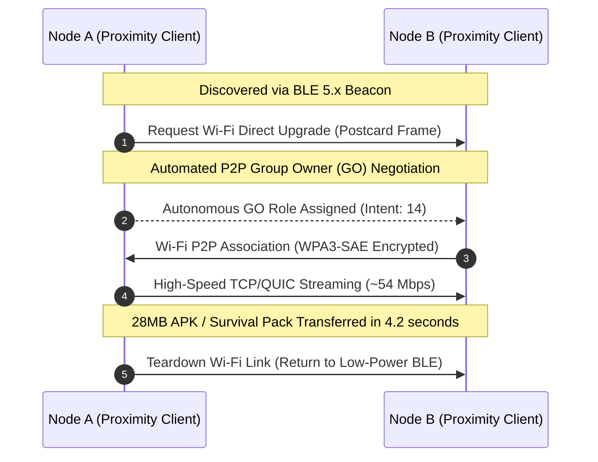

# Part XII: Multi-Transport Abstraction & Physical Link Orchestration

## 1. Overview & Multi-Transport Vision

Traditional messaging networks assume an underlying reliable IP network (TCP/IP, cellular 4G/5G, or Wi-Fi). When physical cell towers fail or power grids collapse, these applications become instantly non-functional.

**SIAR decouples communication from IP networking entirely.** The core SIAR routing and DTN engine operates over an abstract, heterogeneous physical transport layer. A single message bundle may hop over **BLE** between two pedestrians, transfer over high-speed **Wi-Fi Direct** between parked vehicles, bounce over **LoRa** across 15 kilometers of mountainous terrain, and transit over **QUIC** whenever an active internet gateway is encountered.

```
+-----------------------------------------------------------------------------------+
|                     SIAR MULTI-TRANSPORT ORCHESTRATION STACK                     |
+-----------------------------------------------------------------------------------+
|                  [ Application Layer: Messaging / File Sharing / SOS ]             |
|                                            |                                      |
|                  [ DTN Store-Carry-Forward & Routing Policy Engine ]               |
|                                            |                                      |
|                  [ Unified Transport Abstraction Trait (Async Rust) ]              |
|                                            |                                      |
|        +-----------------+-----------------+-----------------+-----------------+  |
|        |                 |                 |                 |                 |  |
|        v                 v                 v                 v                 v  |
|    [ BLE 5.4 ]      [ Wi-Fi Direct ]  [ Wi-Fi Aware ]   [ LoRa SX1262 ]   [ QUIC/IP ] |
|  L2CAP CoC Mode    P2P Group Owner      NAN Clusters     868/915 MHz Mesh  Zero-RTT   |
|   ~1.4 Mbps / 30m    ~54 Mbps / 100m    ~12 Mbps / 60m    ~5.4 kbps / 15km   WAN/LAN  |
+-----------------------------------------------------------------------------------+
```

---

## 2. Unified Transport Trait Architecture

Every physical radio hardware driver implements the asynchronous, zero-copy `Transport` trait defined in `crates/siar-transport`:

```rust
use async_trait::async_trait;
use tokio::sync::mpsc;

/// Physical hardware transport type identifier
#[repr(u8)]
#[derive(Copy, Clone, Debug, PartialEq, Eq, Hash, Serialize, Deserialize)]
pub enum TransportType {
    Ble = 0x01,
    WifiDirect = 0x02,
    WifiAware = 0x03,
    LoRa = 0x04,
    Quic = 0x05,
    UnixSocket = 0x06,
}

/// Link capabilities and operational constraints
#[derive(Clone, Debug)]
pub struct TransportCapabilities {
    pub max_mtu_bytes: usize,
    pub nominal_bandwidth_bps: u64,
    pub typical_range_meters: u32,
    pub supports_broadcast: bool,
    pub energy_cost_per_kb_microjoules: u32,
}

/// Core Async Transport Interface
#[async_trait]
pub trait Transport: Send + Sync + 'static {
    /// Return the hardware transport classification
    fn transport_type(&self) -> TransportType;

    /// Retrieve static hardware link capabilities
    fn capabilities(&self) -> TransportCapabilities;

    /// Start discovery beacons and listener loops
    async fn start(&mut self, tx_inbound: mpsc::Sender<InboundFrame>) -> Result<(), TransportError>;

    /// Send a raw binary frame to an explicit hardware peer endpoint
    async fn send_frame(&self, peer_endpoint: &PeerEndpoint, data: &[u8]) -> Result<(), TransportError>;

    /// Broadcast a frame to all physically reachable neighbors in radio range
    async fn broadcast_frame(&self, data: &[u8]) -> Result<usize, TransportError>;

    /// Measure current real-time Link Quality Metrics (RSSI, SNR, packet loss)
    async fn probe_link_quality(&self, peer_endpoint: &PeerEndpoint) -> Result<LinkQuality, TransportError>;

    /// Graceful shutdown of hardware radio interfaces
    async fn stop(&mut self) -> Result<(), TransportError>;
}
```

---

## 3. Bluetooth Low Energy (BLE 5.x) Driver Architecture

BLE provides low-power, continuous background discovery and proximity transfers without pairing prompts:

```
[ BLE Extended Advertising (PHY Coded / 1M) ]
  - Payload: Magic b"SIAR" + Device Short Hash (8B) + Transport Capabilities Bitmask
  - Interval: 250ms (Active Scan) / 1280ms (Background Low-Power)
        |
        v (Peer Discovered)
[ GATT Connection Establishment ]
  - Negotiate MTU: 512 Bytes (ATT_MTU Exchange)
  - Negotiate Connection Parameters: Interval 15ms, Slave Latency 0, Supervision Timeout 2000ms
        |
        v (Throughput Upgrade)
[ L2CAP Connection-Oriented Channels (CoC) ]
  - Bypasses GATT attribute database overhead entirely
  - Delivers raw streaming throughput up to 1.4 Mbps on BLE 5.x 2M PHY
```

### 3.1 BLE Packet Framing & MTU Slicing

Because raw BLE packets are limited in physical MTU, `siar-transport-ble` implements deterministic packet fragmentation:

```rust
#[repr(packed)]
pub struct BleFragmentHeader {
    pub frame_id: u16,
    pub fragment_index: u8,
    pub total_fragments: u8,
    pub checksum_crc16: u16,
}
```

---

## 4. Wi-Fi Direct (P2P) & Wi-Fi Aware (NAN) Orchestration

When high-bandwidth data transfers (audio recordings, offline map vector tiles, video messages, or large OS binary survival packs) are required, SIAR dynamically negotiates high-speed Wi-Fi ad-hoc links:



### 4.1 Wi-Fi Aware (Neighbor Awareness Networking - NAN)

On compatible Android 8.0+ hardware and embedded Linux Wi-Fi chips:
- Operates entirely cluster-based on Channel 6 (2.4 GHz) and Channel 149 (5 GHz) without requiring traditional Wi-Fi Access Point infrastructure.
- Uses Publish/Subscribe service discovery (`siar.mesh.service.v1`) to exchange metadata before waking Wi-Fi radio data paths.

---

## 5. LoRa SX1262 Long-Range Hardware Transport

For ultra-long-range off-grid links (search-and-rescue, maritime, rural, and mountain networks):

```
+-----------------------------------------------------------------------------------+
|                        LoRa SX1262 CONFIGURATION SPECIFICATION                    |
+-----------------------------------------------------------------------------------+
| Frequency Bands:    | 868.1 MHz (EU) / 915.0 MHz (US) / 433.0 MHz (Global ISM)   |
| Modulation:         | Chirp Spread Spectrum (CSS)                                 |
| Spreading Factor:   | SF7 (High Speed: 5.4 kbps) to SF11 (Extreme Range: 450 bps)|
| Bandwidth:          | 125 kHz / 250 kHz / 500 kHz                                 |
| Coding Rate:        | 4/5 (Error correction forward parity)                       |
| Max Transmit Power: | +22 dBm (160 mW) with automated dynamic power control       |
| Max Physical MTU:   | 255 Bytes per transmission                                  |
+-----------------------------------------------------------------------------------+
```

### 5.1 Airtime Regulation & Duty-Cycle Enforcement

To comply with regional telecom laws (e.g., EU ETSI 1% hourly duty cycle) and prevent mesh congestion:
- The driver computes fractional airtime per transmission:
  $$T_{\text{airtime}} = \frac{2^M}{\text{BW}} \times (\text{Preamble} + \text{Payload Symbols})$$
- Enforces an automated token-bucket scheduler. If the duty-cycle quota is exhausted, low-priority bundles are deferred into flash storage while emergency SOS packets bypass rate limits.

---

## 6. Dynamic Link Quality Estimator & Energy Scheduler

To autonomously route packets across the most efficient path, `siar-transport` computes an **Expected Transmission Count (ETX)** metric:

$$\text{ETX} = \frac{1}{d_f \times d_r}$$

Where:
- $d_f$ = Forward packet delivery probability (measured by heartbeat ACKs)
- $d_r$ = Reverse packet delivery probability

```rust
#[derive(Clone, Debug)]
pub struct LinkQuality {
    pub rssi_dbm: i16,
    pub snr_db: f32,
    pub packet_loss_rate: f32,
    pub etx: f32,
    pub last_seen_epoch_ms: u64,
}

impl LinkQuality {
    pub fn is_viable_for_realtime(&self) -> bool {
        self.etx < 2.5 && self.packet_loss_rate < 0.20
    }
}
```

### 6.1 Battery-Aware Adaptive Scheduling

On mobile devices, the transport orchestrator continuously monitors battery level:
- **`> 50% Battery`**: Full continuous scanning (BLE 100% duty, Wi-Fi Direct active, 1-second routing discovery).
- **`20% - 50% Battery`**: Balanced mode (BLE 25% duty cycle, Wi-Fi Direct on-demand only).
- **`< 20% Battery (Emergency Conservation)`**: Ultra-low-power mode (BLE beacon once every 10 seconds, radio sleeps in between, Wi-Fi disabled except for manual user SOS).
