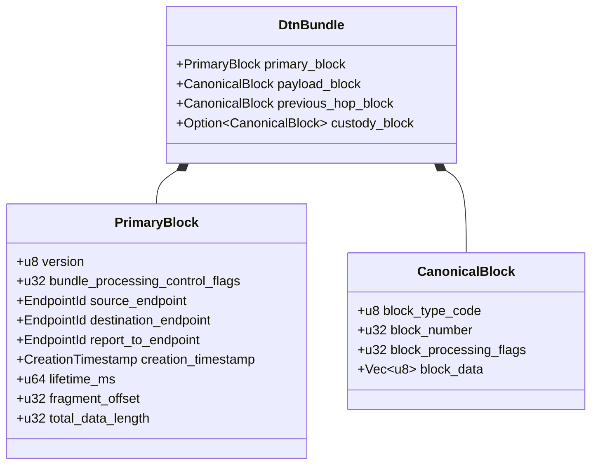
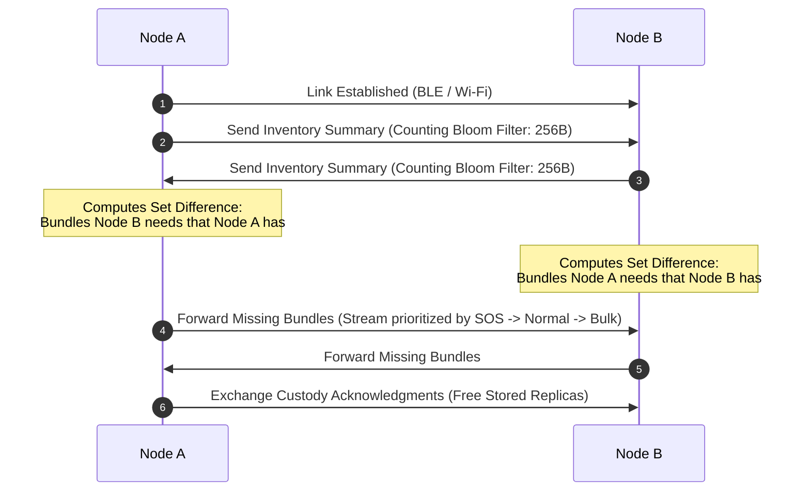

# Part XIII: Delay-Tolerant Networking (DTN), Epidemic Routing & Storage Engine

## 1. Overview & DTN Architecture Philosophy

In standard computer networks, end-to-end connectivity between sender and recipient is an invariant assumption. If a single intermediate router or link is down, packets are dropped and connections fail.

In real-world disaster zones, remote terrains, or blackout scenarios, **continuous end-to-end paths almost never exist**. Nodes move independently, connections are intermittent, and air-gaps can span minutes, hours, or days.

**SIAR implements Delay-Tolerant Networking (DTN) based on the Store-Carry-Forward paradigm.** When a destination node is unreachable, the message bundle is safely persisted into encrypted non-volatile local storage. The node carries the bundle physically through space as the user moves, forwarding copies to intermediate relay nodes whenever opportunistic radio links appear.

```
+-----------------------------------------------------------------------------------+
|                     SIAR STORE-CARRY-FORWARD AIR-GAP TRANSIT                      |
+-----------------------------------------------------------------------------------+
| [ Alice: Isolated Shelter ]                                                       |
|       |                                                                           |
|   (Air-Gap: No Internet / No Tower)                                               |
|       v                                                                           |
| [ Intermediate Courier Node: Search & Rescue Drone / Volunteer Vehicle ]          |
|   - 1. Receives bundle over BLE / Wi-Fi Direct                                    |
|   - 2. Stores bundle in local encrypted LMDB / Sled flash storage                 |
|   - 3. Carries bundle physically across 10 km air-gap                             |
|       v                                                                           |
| [ Repeater Gateway: Base Camp ]                                                   |
|   - 4. Discovers gateway via radio beacon                                         |
|   - 5. Drains DTN queue and delivers bundle to Bob                                |
+-----------------------------------------------------------------------------------+
```

---

## 2. DTN Bundle Protocol Architecture & Wire Envelope

SIAR’s bundle format adapts core concepts from **RFC 5050** and **RFC 9171 (Bundle Protocol Version 7)**, optimized for low-overhead embedded execution using Postcard binary serialization.



### 2.1 Bundle Processing Control Flags (Bitmask)

```rust
pub struct BundleFlags;

impl BundleFlags {
    pub const FRAGMENTATION_ALLOWED: u32    = 1 << 0;
    pub const CUSTODY_TRANSFER_REQUESTED: u32 = 1 << 1;
    pub const DESTINATION_IS_BROADCAST: u32  = 1 << 2;
    pub const DELIVERY_ACK_REQUESTED: u32   = 1 << 3;
    pub const STATUS_REPORT_FORWARD: u32    = 1 << 4;
    pub const STATUS_REPORT_DELIVERY: u32   = 1 << 5;
    pub const STATUS_REPORT_DELETION: u32   = 1 << 6;
    pub const PRIORITY_BULK: u32            = 0 << 7;
    pub const PRIORITY_NORMAL: u32          = 1 << 7;
    pub const PRIORITY_EXPEDITED: u32       = 2 << 7;
    pub const PRIORITY_EMERGENCY_SOS: u32   = 3 << 7;
}
```

---

## 3. Autonomous Routing Heuristics

SIAR supports multiple configurable routing strategies depending on network density, storage limits, and priority classes:

```
[ Inbound DTN Bundle ]
         |
         v
+-----------------------------------------------------------+
| Priority == EMERGENCY_SOS (0x03)?                         |
|   ├── YES: Execute Unrestricted Epidemic Flooding (Max TTL)|
|   └── NO:  Evaluate Probabilistic / Contact Routing Engine |
+-----------------------------------------------------------+
         |
         v
+-----------------------------------------------------------+
| Routing Algorithms:                                       |
| 1. Direct Contact Routing (Wait for direct peer encounter)|
| 2. PRoPHET (Probabilistic Routing Protocol using History) |
| 3. Spray-and-Wait (Constrained replication, L=6 copies)   |
+-----------------------------------------------------------+
```

### 3.1 PRoPHET Delivery Predictability Metric

Nodes calculate a **Delivery Predictability Metric** $P(a, b) \in [0, 1]$ representing the probability that node $A$ will encounter node $B$:

1. **Direct Encounter Update**:
   $$P(a, b)_{\text{new}} = P(a, b)_{\text{old}} + (1 - P(a, b)_{\text{old}}) \times P_{\text{enc}}$$
2. **Aging (Time Decay)**:
   $$P(a, b)_{\text{new}} = P(a, b)_{\text{old}} \times \gamma^k$$
   *(where $\gamma \in (0, 1)$ is the aging constant and $k$ is elapsed time units)*
3. **Transitive Property**:
   $$P(a, c)_{\text{new}} = \max(P(a, c)_{\text{old}}, P(a, b) \times P(b, c) \times \beta)$$

When Node $A$ encounters Node $B$, $A$ only forwards a bundle destined for Node $D$ to Node $B$ if:
$$P(b, d) > P(a, d)$$

---

## 4. Anti-Entropy State Synchronization (Bloom Filter Vectors)

To prevent transmitting redundant bundles that a neighbor already holds, nodes execute an **Anti-Entropy Vector Exchange** upon establishing a link:



---

## 5. Zero-Copy Persistent Bundle Storage Engine

DTN queues require reliable, power-loss-safe storage that functions on low-end flash memory (e.g., eMMC, SD cards, raw NAND flash).

SIAR integrates an embedded zero-copy storage backend using **LMDB (Lightning Memory-Mapped Database)** or pure-Rust **Sled / redb**:

```rust
use redb::{Database, TableDefinition};

const DTN_BUNDLES_TABLE: TableDefinition<&[u8; 32], &[u8]> = TableDefinition::new("dtn_bundles");
const DTN_METADATA_TABLE: TableDefinition<&[u8; 32], &[u8]> = TableDefinition::new("dtn_meta");

pub struct DtnStorageEngine {
    db: Database,
    max_storage_bytes: u64,
    current_usage_bytes: u64,
}

impl DtnStorageEngine {
    /// Persist a bundle atomically with zero-copy memory mapping
    pub fn store_bundle(&mut self, bundle_id: &[u8; 32], raw_bytes: &[u8], meta: &BundleMetadata) -> Result<(), StorageError> {
        // Enforce quota: evict lower-priority expired bundles if required
        if self.current_usage_bytes + (raw_bytes.len() as u64) > self.max_storage_bytes {
            self.evict_lowest_priority(raw_bytes.len() as u64)?;
        }

        let write_txn = self.db.begin_write()?;
        {
            let mut bundles = write_txn.open_table(DTN_BUNDLES_TABLE)?;
            let mut metadata = write_txn.open_table(DTN_METADATA_TABLE)?;
            bundles.insert(bundle_id, raw_bytes)?;
            metadata.insert(bundle_id, &postcard::to_allocvec(meta)?)?;
        }
        write_txn.commit()?;
        self.current_usage_bytes += raw_bytes.len() as u64;
        Ok(())
    }
}
```

### 5.1 Flash Wear-Leveling & Quota Eviction Policy

When storage fills up under heavy message floods:
1. **Eviction Order**:
   - Class 1: Expired bundles ($\text{Timestamp} + \text{Lifetime} < \text{Now}$).
   - Class 2: Bundles whose custody has been acknowledged by at least 2 downstream custodians.
   - Class 3: Bulk payloads (media files, maps).
   - Class 4: Normal chat messages (oldest first).
   - **IMMUTABLE**: Emergency SOS alerts (`0x0F`) are NEVER evicted until explicitly acknowledged or TTL hard expires.
2. **Flash Wear Protection**: Write transactions are coalesced in memory and flushed in sequential append blocks to prevent flash cell degradation on portable emergency nodes.
