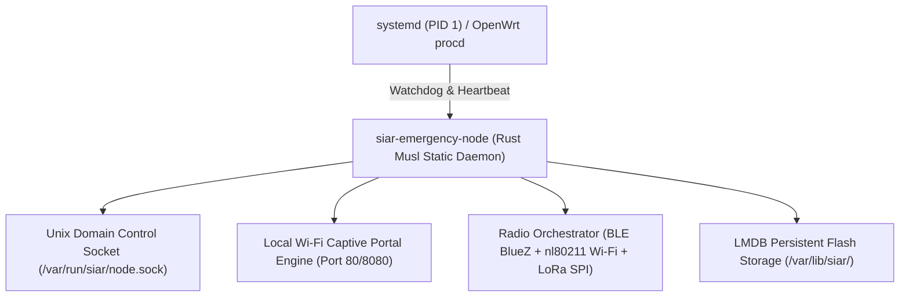

# Part XIV: Cross-Platform Native Clients & Embedded Daemon Architecture

## 1. Overview & Multi-Form-Factor Strategy

SIAR is engineered to run seamlessly across three distinct hardware and operational tiers:
1. **Mobile Handsets (Android)**: Touchscreen-optimized, battery-conservative user application.
2. **Desktop Workstations (Linux, macOS, Windows)**: Multi-window tactical dashboard, large file sharing station, and local bridge.
3. **Headless Embedded Repeaters (`siar-emergency-node`)**: Autonomous, low-power headless Linux daemons running on Raspberry Pi, OpenWrt routers, and solar-powered bunker nodes.

```
+-----------------------------------------------------------------------------------+
|                        SIAR UNIFIED CORE ARCHITECTURE MATRIX                      |
+-----------------------------------------------------------------------------------+
|               [ Pure-Rust Core Engine: crates/siar-core, transport, dtn ]        |
|                                            |                                      |
|        +-----------------------------------+----------------------------------+   |
|        |                                   |                                  |   |
|        v                                   v                                  v   |
| [ Android Mobile Client ]         [ Desktop GUI Client ]         [ Headless Node ]|
| - Kotlin / Jetpack Compose        - Dioxus / Slint Rust UI       - Pure-Rust CLI  |
| - JNI FFI Bridge Layer            - Native Wayland/X11/Cocoa/Win - Unix Socket IPC|
| - Android Foreground Service      - Hardware AV1 / Opus Dec      - Systemd Daemon |
| - BLE / Wi-Fi Direct NDK          - Local WebRTC Gateway         - OpenWrt / Pi   |
+-----------------------------------------------------------------------------------+
```

---

## 2. Android Kotlin & Jetpack Compose Client Architecture

### 2.1 Native JNI Memory Bridge (`siar-jni`)

To ensure maximum battery efficiency and eliminate garbage collector (GC) pauses during high-speed mesh forwarding, the Android application delegates all cryptographic, routing, and storage operations to the native Rust engine via a zero-copy JNI layer:

```
[ Kotlin / Jetpack Compose UI ] <---> [ Kotlin Repository Layer ]
                                                 |
                                     (JNI ByteBuffer / Pointer)
                                                 v
                                  [ Rust FFI Glue (siar-jni) ]
                                                 |
                                     (Tokio Async Runtime)
                                                 v
                                    [ Pure-Rust SIAR Engine ]
```

#### Zero-Copy JNI Buffer Exchange:

```rust
// crates/rust-jni-glue/src/lib.rs
#[no_mangle]
pub unsafe extern "system" fn Java_org_siar_core_SiarBridge_nativeProcessFrame(
    env: JNIEnv,
    _class: JClass,
    node_ptr: jlong,
    byte_buffer: jobject,
) -> jint {
    let node = &mut *(node_ptr as *mut SiarNodeHandle);
    let direct_address = env.get_direct_buffer_address(byte_buffer).unwrap();
    let capacity = env.get_direct_buffer_capacity(byte_buffer).unwrap();
    
    let slice = std::slice::from_raw_parts(direct_address as *const u8, capacity as usize);
    match node.process_incoming_wire_frame(slice) {
        Ok(bytes_processed) => bytes_processed as jint,
        Err(_) => -1,
    }
}
```

### 2.2 Android Background Execution & Doze Mode Mitigation

Modern Android aggressively suspends background apps to preserve battery. To maintain mesh relay capabilities when the screen is off:

1. **Persistent Sticky Foreground Service**: Runs `SiarMeshForegroundService` with a low-priority system notification (*"SIAR Mesh Relay Active"*).
2. **Partial WakeLocks**: Acquired only during active burst transmission over Wi-Fi Direct and released immediately upon queue completion.
3. **Android JobScheduler / WorkManager**: Periodic 15-minute background discovery pulses to sync DTN bundles during deep sleep.

---

## 3. Desktop Workstation Client Architecture (Dioxus / Slint)

The desktop client is written in pure Rust using **Dioxus** or **Slint**, compiling directly to native machine code without the memory bloat of Electron or Chromium wrappers:

```
+-----------------------------------------------------------------------------------------+
|                                SIAR DESKTOP WORKSTATION                                 |
+-----------------------------------------------------------------------------------------+
| [👥 Channels: #emergency-medic, #logistics]  |  [💬 Active Channel: #emergency-medic ]  |
|                                              |                                          |
| Active Peers:                                |  [10:42:01] Dr. Elena (Medic-1):         |
|  🟢 Alice (Repeater-1, BLE)                  |  "Field clinic operational at Sector 4." |
|  🟡 Bob (DTN Queue: 2 hops)                  |                                          |
|  🟢 Basecamp-HQ (QUIC WAN)                   |  [10:43:15] Rescue-Drone-Alpha:          |
|                                              |  "Attached thermal scan (2.4 MB)"        |
| Link Statistics:                             |  [ 🖼️ thermal_sector4.avif ] [Download]   |
|  - Inbound: 1.4 Mbps | Outbound: 820 kbps    |                                          |
|  - DTN Bundles in Buffer: 18 (2.1 MB)        |  +-------------------------------------+ |
|  - Active Transports: [BLE] [WiFi-P2P] [QUIC]|  | Type encrypted broadcast message... | |
+-----------------------------------------------------------------------------------------+
```

- **Memory Footprint**: `< 24 MB RAM` in idle standby.
- **Hardware-Accelerated Codecs**: AV1 image decoding via `dav1d` and Opus audio processing via `audiopus`.

---

## 4. Headless Embedded Linux Daemon (`siar-emergency-node`)

The headless daemon is designed for autonomous, unattended deployment on solar-powered repeaters, municipal towers, and disaster response vehicles:



### 4.1 Systemd Service Unit (`/etc/systemd/system/siar-emergency-node.service`)

```ini
[Unit]
Description=SIAR Autonomous Mesh Repeater & Emergency Node
After=network.target bluetooth.target
Wants=bluetooth.target

[Service]
Type=notify
ExecStart=/usr/local/bin/siar-emergency-node --config /etc/siar/node.toml
Restart=always
RestartSec=3s
WatchdogSec=30s
User=siar
Group=siar
AmbientCapabilities=CAP_NET_ADMIN CAP_NET_RAW CAP_NET_BIND_SERVICE
ProtectSystem=strict
ProtectHome=true
ReadWritePaths=/var/lib/siar /var/run/siar
LimitNOFILE=65536
MemoryMax=128M

[Install]
WantedBy=multi-user.target
```

---

## 5. Local Control IPC Socket & JSON-RPC Schema

Third-party scripts, automated emergency sirens, and local dashboards interact with the daemon via `/var/run/siar/node.sock`:

```json
// Example: Querying active neighbor topology
// Request:
{
  "jsonrpc": "2.0",
  "method": "siar_get_mesh_topology",
  "params": {
    "include_link_metrics": true
  },
  "id": 42
}

// Response:
{
  "jsonrpc": "2.0",
  "result": {
    "node_id": "siar17a4fb918cc3da10e",
    "uptime_seconds": 84120,
    "battery_percent": 94.2,
    "neighbors": [
      {
        "peer_id": "siar19b1288ff12bc9022",
        "alias": "Field Medic 1",
        "transport": "BLE",
        "rssi_dbm": -68,
        "snr_db": 12.4,
        "etx": 1.15
      }
    ],
    "dtn_queue": {
      "total_bundles": 7,
      "storage_used_bytes": 1420800
    }
  },
  "id": 42
}
```
