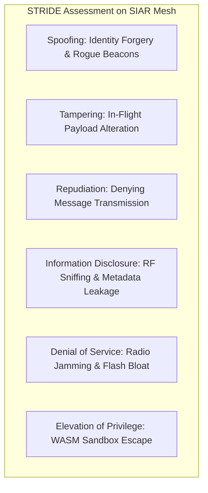

# Part XV: Threat Modeling, Attack Surface Analysis & Zero-Trust Defense Matrix

## 1. Overview & Threat Model

SIAR is designed to operate in high-threat environments: disaster zones, authoritarian regimes, military combat zones, and targeted surveillance environments.

We assume a **powerful, well-resourced adversary** capable of:
1. **Passive Radio Eavesdropping**: Capturing all wireless packets (BLE, Wi-Fi, LoRa, RF) across wide geographic areas.
2. **Active Radio Jamming & Packet Injection**: Attempting to flood wireless spectrum, forge packets, and modify payloads in-flight.
3. **Malicious / Compromised Relay Nodes**: Operating malicious repeaters that drop packets, record metadata, or attempt Sybil attacks.
4. **Physical Node Seizure**: Confiscating lost or captured mobile phones or solar repeaters to extract cryptographic material and conversation history.
5. **Infrastructure Compromise**: Compromising DNS servers, web hosting providers, or package distribution CDNs.

```
+-----------------------------------------------------------------------------------+
|                        SIAR ZERO-TRUST THREAT DEFENSE MATRIX                      |
+-----------------------------------------------------------------------------------+
| THREAT VECTOR         | ADVERSARY OBJECTIVE        | SIAR CRYPTOGRAPHIC DEFENSE   |
|-----------------------+----------------------------+------------------------------|
| Eavesdropping (RF)    | Read message contents      | OpenMLS + ChaCha20-Poly1305  |
| Packet Tampering      | Modify in-flight alerts    | Ed25519 Signatures + BLAKE3  |
| Sybil Node Flood      | Hijack routing tables      | PoW Puzzles + WoT Endorsements|
| DTN Queue Exhaustion  | Starve node flash memory   | Quotas + SOS Immunity Rules  |
| Traffic Analysis      | Map user social graphs     | Packet Padding + Random Delay|
| Physical Device Theft | Extract chat history       | PFS/PCS Ratchet + Zeroize    |
| Rogue Mirror / CDN    | Distribute backdoored apps | SLSA L3 + Minisign Signatures|
+-----------------------------------------------------------------------------------+
```

---

## 2. Comprehensive STRIDE Threat Analysis



### 2.1 Threat Breakdown & Countermeasures

| Threat (STRIDE) | Attack Surface | Impact | Mitigation Strategy |
| :--- | :--- | :--- | :--- |
| **Spoofing (S)** | Identity generation, beacon discovery | Impersonating a field commander or medic | Self-sovereign Ed25519 signing keys; out-of-band QR/NFC fingerprint verification. |
| **Tampering (T)** | Multi-hop DTN relay transit | Modifying coordinates in SOS alerts | Cryptographic envelope signing; any bit flip fails Poly1305 MAC and Ed25519 signature. |
| **Repudiation (R)** | Broadcast emergency dispatches | Sender denies issuing distress signal | Non-repudiable cryptographic Ed25519 signatures embedded in every primary bundle block. |
| **Information Disclosure (I)**| Wireless packet sniffers, Wi-Fi probes | Revealing sender/receiver location & timing | Constant-size packet padding (512B / 1024B blocks), MAC address randomization, no cleartext headers. |
| **Denial of Service (D)** | DTN store-carry-forward queues | Filling flash storage with garbage bundles | Proof-of-Work (PoW) dynamic puzzle requirements on bulk packets; strict storage quotas per peer. |
| **Elevation of Privilege (E)**| Third-party WASM plugins | Malicious driver escaping sandbox to host OS | Wasmtime sandbox with zero host filesystem/exec access; strict WASI capability isolation. |

---

## 3. Sybil Attack & Identity Flooding Defenses

In open mesh networks without central identity authorities, an adversary can simulate 10,000 virtual nodes to skew routing algorithms or monopolize bandwidth.

### 3.1 Proof-of-Work (PoW) Identity Puzzles

When node density or queue utilization exceeds 75%, nodes require all non-whitelisted peers to attach a dynamic BLAKE3 Proof-of-Work token to incoming bundles:

$$\text{BLAKE3}(\text{Source\_Key} \parallel \text{Timestamp\_Hour} \parallel \text{Nonce}) < \text{Target\_Difficulty}$$

- **Legitimate Users**: Generating a PoW nonce takes `< 250ms` on a smartphone CPU once per message.
- **Sybil Attacker**: Generating 50,000 messages requires massive compute power, burning battery and choking the attack.

### 3.2 Web of Trust (WoT) Social Graph Validation

- Bundles signed by peers with Direct QR verification are routed immediately without PoW requirements.
- Bundles from unknown ephemeral nodes require progressive PoW difficulty proportional to payload size.

---

## 4. Traffic Analysis & Metadata Obfuscation

Even with end-to-end encryption, traffic analysis (packet timing, frequency, and payload length) can reveal who is talking to whom.

```
[ Variable-Length User Message (42 Bytes) ]
                     |
         (Deterministic Padding)
                     v
[ Padded Payload: Exactly 1024 Bytes ]
                     |
         (Random Delay Insertion: 50ms - 400ms)
                     v
[ Random Physical MAC Address per Session ]
                     |
                     v
[ Transmitted over Wireless Mesh ]
```

1. **Fixed-Size Bucket Padding**: All application payloads are padded with randomized bytes to standard quantization boundaries: `256 B`, `512 B`, `1024 B`, and `4096 B`.
2. **Hop-by-Hop Relay Jitter**: Relay nodes insert a pseudo-random delay ($t_{\text{jitter}} \sim \mathcal{U}(50\text{ms}, 350\text{ms})$) before re-transmitting to defeat timing correlation attacks.
3. **Cover Traffic (Chaff)**: When idle, nodes can be configured to generate synthetic decoy bundles at constant intervals to mask communication bursts.

---

## 5. Physical Node Capture & Anti-Forensics

If an emergency node or phone is captured by hostile forces:

1. **In-Memory Ephemeral Key Zeroization**: All cryptographic keys implement the `Zeroize` trait in Rust, overwriting RAM with zeros upon drop or signal termination.
2. **Encrypted at Rest**: Persistent DTN databases and credentials are encrypted using XChaCha20-Poly1305 derived from a hardware-backed key (Android Keystore / TPM 2.0).
3. **Panic Wipe Trigger**: Entering a pre-configured panic PIN or triggering a GPIO tamper wire on bunker repeaters triggers an instantaneous multi-pass cryptographic wipe of storage keys.
