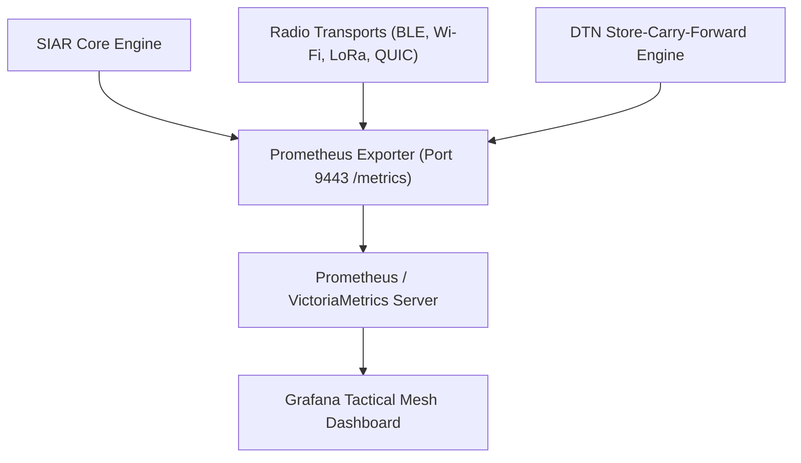

# Part XVI: Telemetry, Observability & Mesh Network Diagnostics Engine

## 1. Overview & Zero-PII Observability Mandate

Maintaining high availability, identifying radio congestion bottlenecks, and debugging intermittent delay-tolerant routing failures in decentralized mesh networks requires robust observability. However, traditional centralized APM tools (Datadog, Sentry, Google Analytics) violate the core privacy and sovereignty guarantees of SIAR.

**SIAR implements a Zero-PII, privacy-preserving, decentralized observability architecture.** Telemetry is computed locally, aggregated on-device, and exported strictly via open standards (Prometheus, OpenTelemetry) without transmitting device identifiers, user message metadata, or physical GPS coordinates.

```
+-----------------------------------------------------------------------------------+
|                        SIAR ZERO-PII OBSERVABILITY ARCHITECTURE                   |
+-----------------------------------------------------------------------------------+
|  1. ZERO IDENTIFIERS       | No device IDs, IP addresses, or MACs in metrics      |
|  2. LOCAL AGGREGATION      | Metrics computed in-memory into histogram buckets    |
|  3. DIFFERENTIAL PRIVACY   | Laplace noise added before optional telemetry sync   |
|  4. PROMETHEUS / OTEL      | Native `/metrics` endpoint for node operators        |
|  5. DISTRIBUTED DTN TRACE  | Hop-by-hop latency and delivery path diagnostic tags |
|  6. INTERACTIVE CLI TOOLS  | `siar diag`, `siar routes`, `siar top`, `siar trace` |
+-----------------------------------------------------------------------------------+
```

---

## 2. Prometheus / OpenTelemetry Metrics Specification

Headless emergency nodes and desktop instances expose a standard Prometheus scrape endpoint on `http://127.0.0.1:9443/metrics`:



### 2.1 Core Prometheus Metric Catalog

```prometheus
# HELP siar_active_neighbors Number of directly reachable radio mesh neighbors
# TYPE siar_active_neighbors gauge
siar_active_neighbors{transport="ble"} 4
siar_active_neighbors{transport="wifi_direct"} 2
siar_active_neighbors{transport="lora"} 12

# HELP siar_dtn_queue_bundles Number of bundles currently residing in local flash storage
# TYPE siar_dtn_queue_bundles gauge
siar_dtn_queue_bundles{priority="sos"} 1
siar_dtn_queue_bundles{priority="normal"} 14
siar_dtn_queue_bundles{priority="bulk"} 3

# HELP siar_dtn_storage_bytes Number of flash storage bytes consumed by DTN queues
# TYPE siar_dtn_storage_bytes gauge
siar_dtn_storage_bytes 4194304

# HELP siar_frames_transferred_total Total frames sent and received by physical transport
# TYPE siar_frames_transferred_total counter
siar_frames_transferred_total{direction="rx",transport="ble"} 14209
siar_frames_transferred_total{direction="tx",transport="ble"} 11842
siar_frames_transferred_total{direction="rx",transport="wifi_direct"} 84210
siar_frames_transferred_total{direction="tx",transport="wifi_direct"} 79044

# HELP siar_link_etx Expected Transmission Count per transport link
# TYPE siar_link_etx histogram
siar_link_etx_bucket{le="1.0"} 8
siar_link_etx_bucket{le="1.5"} 14
siar_link_etx_bucket{le="2.0"} 19
siar_link_etx_bucket{le="+Inf"} 22
```

---

## 3. Prometheus Alerting Rules for Emergency Operators

To enable automatic alerting during disaster response operations:

```yaml
# /etc/prometheus/rules/siar_alerts.yml
groups:
  - name: siar_mesh_alerts
    rules:
      - alert: SiarMeshNodeIsolated
        expr: sum(siar_active_neighbors) == 0
        for: 5m
        labels:
          severity: critical
        annotations:
          summary: "SIAR node has zero active mesh neighbors"
          description: "Node {{ $labels.instance }} has lost radio contact with all peers for > 5 minutes."

      - alert: SiarDtnStorageExhaustion
        expr: siar_dtn_storage_bytes > 450000000 # 450 MB (out of 500 MB quota)
        for: 2m
        labels:
          severity: warning
        annotations:
          summary: "SIAR DTN storage near capacity"
          description: "DTN flash buffer usage at {{ $value | humanizeBytes }}."

      - alert: SiarEmergencySosDetected
        expr: siar_dtn_queue_bundles{priority="sos"} > 0
        for: 0s
        labels:
          severity: page
        annotations:
          summary: "Active Emergency SOS Alert in DTN Queue!"
          description: "Node is carrying {{ $value }} active distress broadcast bundles."
```

---

## 4. Distributed DTN Hop Trace & Latency Profiler

When evaluating network performance across an air-gapped region, nodes can opt to attach an ephemeral **Trace Diagnostic Record** to test bundles:

```
[ Alice: Shelter ] 
  -- Hop 1 (BLE, 14ms, RSSI: -64dBm) --> 
[ Patrol Car 1 ] 
  -- Hop 2 (Air-Gap DTN Storage: 42m 18s) --> 
[ Repeater Bunker 4 ] 
  -- Hop 3 (Wi-Fi P2P, 6ms, RSSI: -52dBm) --> 
[ Bob: Field Hospital ]

Total Delivery Time: 42 minutes, 38 seconds
Physical Hops: 3 | Radio Transports: [BLE, Physical Courier, Wi-Fi P2P]
```

---

## 5. Interactive CLI Diagnostic Tooling Suite

SIAR daemons bundle an interactive terminal diagnostic suite for field engineers and sysadmins:

### 5.1 `siar top` — Live Real-Time Mesh Monitor

```
+-----------------------------------------------------------------------------------------+
| SIAR MESH MONITOR - Node: siar17a4fb9... (Uptime: 14d 06h 22m)         [Q: Quit  R: Reset] |
+-----------------------------------------------------------------------------------------+
| PEER ID              | ALIAS        | TRANSPORT | RSSI    | SNR   | ETX  | TX/RX RATE       |
|----------------------+--------------+-----------+---------+-------+------+------------------|
| siar19b1288ff12...   | Medic-Alpha  | BLE 5.x   | -62 dBm | +14dB | 1.05 | 12 kbps / 48 kbps|
| siar1c44091a08...   | Repeater-02  | WiFi-P2P  | -48 dBm | +28dB | 1.00 | 1.2 Mbps / 4.8 M |
| siar1ee90412ab...   | Drone-Relay  | LoRa 915M | -112dBm | -4 dB | 2.40 | 450 bps / 450 bps|
+-----------------------------------------------------------------------------------------+
| DTN QUEUE: 18 Bundles (2.4 MB / 500 MB) | Flash Writes: 12.4 KB/s | Battery: 98% [Solar] |
+-----------------------------------------------------------------------------------------+
```

### 5.2 Diagnostic Commands:
- `siar diag`: Performs comprehensive self-test on radio hardware, cryptographic keystores, and storage subsystems.
- `siar routes`: Dumps the full PRoPHET and contact routing probability matrix.
- `siar dtn-inspect <BUNDLE_ID>`: Inspects headers, lifetime, priority, and signature validation status of any bundle in local storage.
