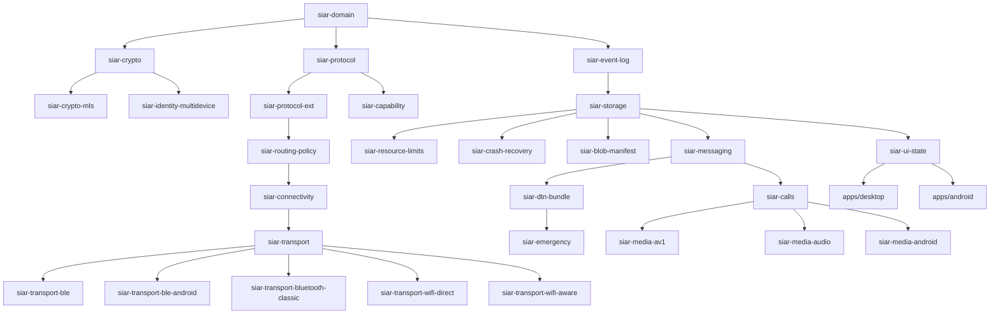

# 01 — System Overview & Architecture

> **Corresponding Specifications:** [`sys-arch/01-protocol-extension-system-architecture.md`](../sys-arch/01-protocol-extension-system-architecture.md), [`sys-arch/07-capability-negotiation-architecture.md`](../sys-arch/07-capability-negotiation-architecture.md), [`sys-arch/28-production-security-e2ee-key-management-privacy-architecture.md`](../sys-arch/28-production-security-e2ee-key-management-privacy-architecture.md)  
> **Key Crates:** [`crates/siar-domain`](../crates/siar-domain), [`crates/siar-protocol`](../crates/siar-protocol), [`crates/siar-protocol-ext`](../crates/siar-protocol-ext), [`crates/siar-capability`](../crates/siar-capability)

---

## 1. Architectural Philosophy & Mission

Traditional modern messengers (WhatsApp, Signal, Telegram) fundamentally assume an always-on infrastructure: centralized server clusters, public DNS, public key infrastructures (PKI), and continuous cellular/broadband Internet access. When natural disasters strike, telecommunications infrastructure collapses, or state-level censorship severs external backhauls, these apps completely fail.

**SIAR** (Survivable Identity & Autonomous Routing) is engineered from first principles to invert these assumptions:
1. **Zero-Infrastructure Invariant**: The system must operate seamlessly when zero external servers, DNS nodes, or Internet gateways are reachable.
2. **Cryptographic Sovereignty**: Identities are root Ed25519 signing pairs owned exclusively by local devices—no phone numbers, email addresses, or centralized registries.
3. **Opportunistic Dissemination**: Messages and files are delay-tolerant bundles that travel over any available medium (BLE, Wi-Fi Direct, Wi-Fi Aware, Bluetooth Classic, LAN, Internet relays) through store-carry-forward physical mules.
4. **Unified Cross-Platform Core**: A high-performance, memory-safe Rust workspace powers CLI daemons, solar-powered mesh repeaters, Android apps, and desktop interfaces.

---

## 2. Layered Architectural Stack

SIAR is structured into five distinct, decoupled architectural layers:

```
+---------------------------------------------------------------------------------------+
|                                5. Applications & UI/UX                                |
|  - apps/android (Jetpack Compose + JNI)   - apps/desktop (Dioxus 0.7 Desktop GUI)     |
|  - apps/emergency-node (Solar Repeater)   - apps/cli (Dev Diagnostics & CLI Node)     |
+---------------------------------------------------------------------------------------+
|                                4. High-Level Services                                 |
|  - siar-messaging (Message & Group Engine)- siar-calls (Realtime AV1 / Opus Sessions) |
|  - siar-identity-multidevice (Certs, SAS) - siar-ui-state (Security Center & Flows)   |
+---------------------------------------------------------------------------------------+
|                            3. Routing, Policy & DTN Engine                            |
|  - siar-routing-policy (Multi-Metric)     - siar-dtn-bundle (Spray-and-Wait Forward)  |
|  - siar-connectivity (Link State Probes)  - siar-emergency (Priority Classes P0-P3)   |
|  - siar-routing (PathTable & Latency)     - siar-dtn (Store-Carry-Forward Buffer)     |
+---------------------------------------------------------------------------------------+
|                             2. Storage, Crypto & Reliability                          |
|  - siar-crypto (Ed25519/X25519 AEAD)      - siar-crypto-mls (RFC 9420 MLS E2EE)       |
|  - siar-storage (Stoolap Embedded SQL)    - siar-blob-manifest (BLAKE3 Merkle DAG)    |
|  - siar-resource-limits (Backpressure)    - siar-crash-recovery (WAL & Checkpoints)   |
|  - siar-event-log (Monotonic Sequence Log)                                            |
+---------------------------------------------------------------------------------------+
|                              1. Transport & Wire Protocols                            |
|  - siar-protocol (Postcard Wire Codec)    - siar-protocol-ext (CapNeg & Scheduler)    |
|  - siar-capability (2-Phase Confirmation) - siar-transport (Pooled Connection Socket) |
|  - siar-transport-ble / -ble-android      - siar-transport-bluetooth-classic (RFCOMM) |
|  - siar-transport-wifi-direct (P2P)       - siar-transport-wifi-aware (NAN Proximity) |
+---------------------------------------------------------------------------------------+
```

---

## 3. Workspace Crate Taxonomy (33 Crates)

The Rust workspace is partitioned into 33 specialized, single-responsibility crates alongside 4 applications and platform drivers:



---

## 4. Survivability Invariants & Operational Modes

SIAR automatically shifts between three distinct operational modes based on real-time link connectivity and energy budgets:

| Operational Mode | Available Networks | Transport Selection | Data Delivery Mechanism |
| :--- | :--- | :--- | :--- |
| **Connected Online** | Internet Relays, LAN, Wi-Fi | Iroh / QUIC, WebSockets | Direct end-to-end QUIC streams, real-time ACKs |
| **Local Tactical Mesh** | Wi-Fi Direct, Wi-Fi Aware, LAN | Direct P2P sockets, multicast | Hop-by-hop local mesh forwarding (sub-10ms latency) |
| **Air-Gapped / Off-Grid** | BLE GATT, Bluetooth Classic | Proximity beaconing, DTN bundles | Physical mule store-carry-forward with Spray-and-Wait |

---

## 5. Protocol Extension & Capability Negotiation

SIAR incorporates a dynamic capability negotiation architecture split across:
1. **Part 01 Protocol Extensions** ([`siar-protocol-ext`](../crates/siar-protocol-ext)): Extension lifecycle management, framing, backpressure, and weighted fair scheduling.
2. **Part 07 Capability Negotiation** ([`siar-capability`](../crates/siar-capability)): Canonical ordered capability sets (`CapabilitySet`), parameterized limits (MaxLimit, Range, Bits, ExactBytes), 3-tier policy filters (`CapabilityPolicy`), two-phase cryptographic confirmation (`NegotiationHash`, `HandshakeNonce`), and dedicated negotiators for `files/1` and `dtn/1`.

When two nodes rendezvous over any transport, they exchange handshake envelopes containing capability bitmasks and structured descriptors:

```rust
pub struct CapabilityBitmask(pub u64);

impl CapabilityBitmask {
    pub const DIRECT_MESSAGING: u64  = 1 << 0;
    pub const DTN_STORE_FORWARD: u64 = 1 << 1;
    pub const AV1_REALTIME_VIDEO: u64 = 1 << 2;
    pub const OPUS_AUDIO_CALL: u64   = 1 << 3;
    pub const MERKLE_BLOB_SYNC: u64  = 1 << 4;
    pub const EMERGENCY_RELAY: u64   = 1 << 5;
    pub const MLS_TREE_RATCHET: u64  = 1 << 6;
}
```

If a peer lacks support for an optional extension (such as AV1 hardware video decoding or Wasm plugins), the protocol gracefully falls back to the baseline profile without session termination. Mutual required capabilities are strictly enforced and verified cryptographically via transcript hashes.
