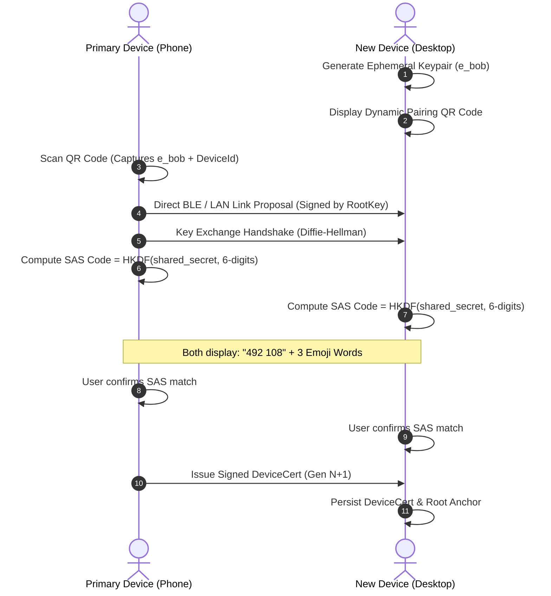

# 02 — Multi-Device Identity & Trust

> **Corresponding Specifications:** [`sys-arch/02-multi-device-identity-architecture.md`](../sys-arch/02-multi-device-identity-architecture.md), [`sys-arch/15-qr-nfc-bootstrap-pairing-architecture.md`](../sys-arch/15-qr-nfc-bootstrap-pairing-architecture.md), [`sys-arch/ui-ux-15-security-center-devices-keys-recovery-architecture.md`](../sys-arch/ui-ux-15-security-center-devices-keys-recovery-architecture.md)  
> **Key Crates:** [`crates/siar-identity-multidevice`](../crates/siar-identity-multidevice), [`crates/siar-crypto`](../crates/siar-crypto), [`crates/siar-domain`](../crates/siar-domain)

---

## 1. Cryptographic Identity Model

In SIAR, an identity is not bound to a phone number, email, or username registered on a centralized server. Instead, every user account is anchored in a sovereign **Root Identity Key** (`RootKey`):

```
                       +-------------------------------+
                       |    Account Root Keypair       |
                       |    Ed25519 (Private / Pub)    |
                       | (Stored in HSM / StrongBox)   |
                       +---------------+---------------+
                                       | Signs
          +----------------------------+----------------------------+
          |                                                         |
+---------v---------+                                     +---------v---------+
| Primary Phone     |                                     | Laptop Desktop    |
| Device Key & Cert |                                     | Device Key & Cert |
| (Gen 1, Active)   |                                     | (Gen 2, Active)   |
+-------------------+                                     +-------------------+
```

### Identity Principles
1. **Offline Key Generation**: Keys are generated locally using OS-level secure hardware entropy (`getrandom` / Android `KeyStore` / Secure Enclave).
2. **Delegated Device Certificates**: The root key signs individual device keys via cryptographic certificates (`DeviceCert`). The root private key can remain offline or locked in hardware storage.
3. **Monotonic Device Generations**: Every device certificate carries a strictly increasing generation counter (`u64`) to prevent rollback and replay attacks.

---

## 2. Multi-Device Trust Store & Certificate Chains

Each node maintains a verified `DeviceTrustStore` that indexes valid peer certificates and revoked tombstones:

```rust
pub struct DeviceCert {
    pub account_id: AccountId,
    pub device_id: DeviceId,
    pub device_public_key: PublicKey,
    pub generation: u64,
    pub capabilities: CapabilityBitmask,
    pub issued_at: Timestamp,
    pub expires_at: Option<Timestamp>,
    pub signature: Signature, // Signed by Account RootKey
}
```

### Certificate Validation Rules
1. The `signature` over the certificate payload must verify against the account's known `RootPublicKey`.
2. The `generation` must be greater than or equal to the last recorded generation for that `DeviceId`.
3. If a `RevocationTombstone` exists for the given `DeviceId` with an equal or higher generation, the certificate is rejected immediately.

---

## 3. Device Pairing & SAS Out-of-Band Verification

When a user links a secondary device (e.g., adding a desktop app to an existing phone account), they execute a zero-knowledge, out-of-band mutual authentication protocol:



---

## 4. Revocation & Tombstone Propagation

When a device is lost, stolen, or decommissioned, the account root key issues a `RevocationTombstone`:

```rust
pub struct RevocationTombstone {
    pub account_id: AccountId,
    pub device_id: DeviceId,
    pub revoked_generation: u64,
    pub reason: RevocationReason,
    pub timestamp: Timestamp,
    pub signature: Signature, // Signed by RootKey
}
```

### Tombstone Gossip Protocol
1. Revocation tombstones are marked with `Priority::High` and gossiped aggressively across all active mesh links and DTN bundles.
2. Any node receiving a tombstone updates its local `DeviceTrustStore` and immediately drops all existing sessions, TLS/Iroh tunnels, and MLS group key material associated with the revoked `DeviceId`.
3. Once revoked, a device cannot rejoin groups without a fresh provisioning flow and newly signed certificate.

---

## 5. Safety Fingerprints & Contact Verification (`safety_fingerprint.rs`)

To defend against man-in-the-middle attacks across asynchronous contacts, SIAR computes a canonical `SafetyFingerprint`:

```rust
pub struct SafetyFingerprint {
    pub raw_bytes: [u8; 32],
}

impl SafetyFingerprint {
    /// Generates a standardized 60-digit numeric safety number formatted as
    /// twelve 5-digit blocks, or a 4-word mnemonic for oral verification.
    pub fn compute(local_root: &PublicKey, remote_root: &PublicKey) -> Self;
    pub fn format_blocks(&self) -> String; // e.g. "34912 90124 55192 ..."
    pub fn format_words(&self) -> String;  // e.g. "orbit-falcon-ember-river"
}
```

When an existing contact provisions a new secondary device or rotates their root identity, the safety fingerprint status automatically transitions from `Verified` to `ChangedUnverified`, notifying the user with inline visual banners before outgoing messages can be sent.

---

## 6. Guided Loss & Security Center Integration (`ui-ux-15`)

SIAR integrates a dedicated **Security Center** (`siar-ui-state` + `apps/desktop`):
- **Granular Revocation Capabilities** (`RevocationCapabilities`): Evaluates whether a target device can be remotely signed out (`sign_out_copy`), explicitly acknowledging when revocation cannot erase pre-existing offline local database copies.
- **Recovery Scopes** (`RecoveryScope`): Manages cold-storage seed phrases, multi-party threshold shares, and clear warnings regarding unrecoverable message history when restoring to new devices.
- **Compromise Response Playbook**: A structured checklist including step preemption, contact re-verification (`ReVerifyAffectedContacts`), and fresh encrypted vault generation (`CreateFreshBackup`).
