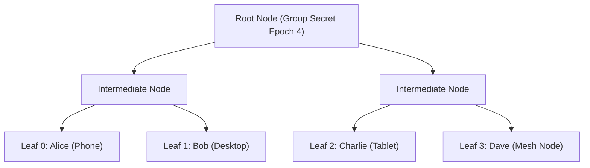

# 03 — Cryptographic Engine & Key Management

> **Corresponding Specifications:** [`sys-arch/28-production-security-e2ee-key-management-privacy-architecture.md`](../sys-arch/28-production-security-e2ee-key-management-privacy-architecture.md), [`sys-arch/05-robust-file-blob-subsystem-architecture.md`](../sys-arch/05-robust-file-blob-subsystem-architecture.md)  
> **Key Crates:** [`crates/siar-crypto`](../crates/siar-crypto), [`crates/siar-crypto-mls`](../crates/siar-crypto-mls), [`crates/siar-blob-manifest`](../crates/siar-blob-manifest)

---

## 1. Cryptographic Primitives & Design

SIAR implements a modern, memory-safe cryptographic pipeline using audited Rust implementations (`ring`, `dalek-cryptography`, `blake3`, `chacha20poly1305`):

| Function | Algorithm / Standard | Library Implementation | Security Margin |
| :--- | :--- | :--- | :--- |
| **Digital Signatures** | Ed25519 (EdDSA) | `ed25519-dalek` | 128-bit security, deterministic |
| **Key Agreement** | X25519 (ECDH) | `x25519-dalek` | Constant-time curve25519 |
| **Symmetric AEAD** | ChaCha20-Poly1305 / AES-256-GCM | `chacha20poly1305` / `ring` | Authenticated encryption with associated data |
| **Cryptographic Hashing** | BLAKE3 | `blake3` | 256-bit security, tree-hashing, SIMD accelerated |
| **Key Derivation** | HKDF-BLAKE3 / HKDF-SHA256 | `blake3::derive_key` / `ring::hkdf` | RFC 5869 extract-and-expand |
| **Group E2EE** | IETF MLS (RFC 9420) | [`siar-crypto-mls`](../crates/siar-crypto-mls) | TreeKEM asynchronous ratcheting |

---

## 2. Pairwise Messaging: Double Ratchet with Sealed Envelopes

For 1-on-1 direct conversations, SIAR employs the **Double Ratchet** protocol combined with encrypted headers to ensure Forward Secrecy (FS) and Post-Compromise Security (PCS):

```
       +------------------------------------------------------------+
       |                     Root Ratchet (DH)                      |
       |  Derives new sending/receiving chain keys on every DH step |
       +-----------------------------+------------------------------+
                                     |
              +----------------------+----------------------+
              |                                             |
   +----------v-----------+                      +----------v-----------+
   |  Sending Chain (SND) |                      | Receiving Chain (RCV)|
   |  Symmetric KDF Step  |                      | Symmetric KDF Step   |
   +----------+-----------+                      +----------+-----------+
              |                                             |
   +----------v-----------+                      +----------v-----------+
   | Message Key (Mk_N)   |                      | Message Key (Mk_M)   |
   | One-time encryption  |                      | One-time decryption  |
   +----------------------+                      +----------------------+
```

### Zero-Metadata Envelope Sealing
To protect metadata from intermediate mesh relays and DTN mules:
1. **Outer Transport Frame**: Contains only ephemeral routing tokens and hop counts.
2. **Encrypted Envelope**: The recipient's ephemeral public key is used to seal the envelope payload using anonymous authenticated encryption (Anncrypt / HPKE). Intermediate hops cannot determine the sender or recipient account IDs.

---

## 3. Group Messaging: IETF MLS (RFC 9420) TreeKEM

For multi-party channels and group conversations, pairwise ratchet fan-out ($O(N^2)$) causes severe bandwidth degradation over low-power BLE and mesh networks. SIAR solves this using **TreeKEM** via [`siar-crypto-mls`](../crates/siar-crypto-mls):



### Group Operation Complexity
- **Message Encryption/Decryption**: $O(1)$ symmetric ratchet per message.
- **Member Addition/Removal**: $O(\log N)$ commit updates broadcast across the group.
- **Epoch Evolution**: State transitions occur deterministically via authenticated commit proposals.

---

## 4. Convergent Blob Chunk Encryption

For media attachments, audio messages, and large binary blobs, SIAR uses **BLAKE3 Merkle Tree Convergent Chunking**:
1. Files are split into fixed 64 KiB chunks.
2. Each chunk is hashed with BLAKE3: $h_i = \text{BLAKE3}(C_i)$.
3. The chunk is encrypted with ChaCha20-Poly1305 using a key derived deterministically from its hash: $K_i = \text{HKDF}(h_i, \text{"siar-blob-chunk"})$.
4. The Merkle root of all chunk hashes forms the globally unique `BlobId`.
5. Identical chunks across different files automatically deduplicate in local mesh caches without leaking plaintext content.

---

## 5. Post-Quantum Hybrid KEM Roadmap

To defend against future "Harvest Now, Decrypt Later" quantum attacks, the SIAR cryptographic pipeline is architected for hybrid post-quantum key encapsulation:
- **Primary Layer**: Standard X25519 (Elliptic Curve Diffie-Hellman).
- **Post-Quantum Layer**: ML-KEM-768 (Kyber-768 NIST FIPS 203).
- **Shared Secret Derivation**: $K = \text{HKDF}(\text{Secret}_{\text{X25519}} \parallel \text{Secret}_{\text{ML-KEM}}, \text{"siar-hybrid-v1"})$.
