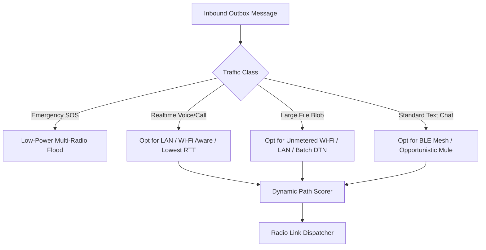

# 04 — Autonomous Routing & Policy Engine

> **Corresponding Specifications:** [`sys-arch/03-transport-routing-policy-engine-architecture.md`](../sys-arch/03-transport-routing-policy-engine-architecture.md), [`sys-arch/12-multipath-networking-architecture.md`](../sys-arch/12-multipath-networking-architecture.md)  
> **Key Crates:** [`crates/siar-routing-policy`](../crates/siar-routing-policy), [`crates/siar-routing`](../crates/siar-routing), [`crates/siar-connectivity`](../crates/siar-connectivity)

---

## 1. Multi-Metric Path Scoring Model

Unlike traditional IP routers that route solely on minimum hop counts or static OSPF costs, SIAR evaluates paths dynamically across six real-time physical dimensions:

$$\text{Score}(P) = w_l \cdot L(P) + w_b \cdot \frac{1}{B(P)} + w_e \cdot E(P) + w_p \cdot \text{PDR}(P) + w_c \cdot C(P) + w_s \cdot S(P)$$

| Metric Dimension | Notation | Weight ($w$) | Description |
| :--- | :--- | :--- | :--- |
| **Latency ($L$)** | Milliseconds ($0–5000\text{ms}$) | Medium | Round-trip time (RTT) measured via micro-probes. |
| **Bandwidth ($B$)** | Megabits/sec ($0.01–1000\text{Mbps}$) | Medium | Available link throughput capacity. |
| **Energy Cost ($E$)** | Milliwatts ($10–2500\text{mW}$) | High (on battery) | Energy drain of radio interface (BLE vs Wi-Fi vs Cellular). |
| **Packet Delivery Ratio ($\text{PDR}$)** | Fraction ($0.0–1.0$) | High | Historical delivery success over last 60 seconds. |
| **Financial Cost ($C$)** | Score ($0–100$) | High | Metered cellular data ($>0$) vs unmetered Wi-Fi/mesh ($0$). |
| **Link Stability ($S$)** | Contact Duration ($s$) | Medium | Expected time before peer moves out of physical radio range. |



---

## 2. Dynamic Link Health Monitoring & Probing

The `LinkHealthMonitor` in [`siar-routing-policy`](../crates/siar-routing-policy) maintains active telemetry for each peer link:

```rust
pub struct LinkMetrics {
    pub rtt_ms: u32,
    pub smoothed_rtt_ms: u32,
    pub packet_loss_rate: f32,
    pub tx_bytes_per_sec: u64,
    pub rx_bytes_per_sec: u64,
    pub last_seen: Instant,
    pub is_metered: bool,
    pub signal_rssi: Option<i8>,
}
```

### Probing Strategy
1. **Active Probes**: Lightweight 32-byte keepalive pings sent on high-bandwidth links every 5–15 seconds.
2. **Passive Probes**: Piggyback telemetry on routine message ACKs and DTN custody signals to conserve radio airtime.
3. **Degradation Detection**: If packet loss exceeds 25% or RSSI drops below -85 dBm, the link is flagged as `Degraded` and the scheduler switches traffic to a standby warm path in $< 50\text{ms}$.

---

## 3. Multipath Scheduler & Warm Failover

SIAR's multipath engine avoids single-point-of-failure routing by maintaining primary, secondary, and fallback routes simultaneously:

```
[Outbox Dispatcher]
        |
        +---> [Active Path: Wi-Fi Direct] (Primary: High Throughput)
        |
        +---> [Standby Path: BLE GATT]   (Warm Backup: Zero-Setup Failover)
        |
        +---> [Cold Path: DTN Relay]     (Asynchronous Storage Queue)
```

- **Warm Failover**: If the Wi-Fi Direct socket disconnects due to physical distance, outgoing frames instantly divert to the active BLE connection without application-layer timeouts.
- **Deduplication Barrier**: Monotonic sequence IDs and message hashes ensure that if duplicate frames arrive over multiple paths, the destination storage layer idempotently acknowledges and ignores copies.

---

## 4. Hysteresis, Retry Policies & Priority Route Dispatch

To prevent route flapping and handle intermittent links gracefully:
- **Stickiness & Hysteresis (`HysteresisPolicy`)**: Requires candidate routes to exceed the current active route's score by a minimum threshold margin (e.g. 15%) before triggering a switch, avoiding wasteful connection thrashing.
- **Exponential Retry Backoff (`RetryPolicy`)**: Failed transmission attempts incur randomized exponential backoff with jitter to protect congested mesh airwaves.
- **Priority-Fair Dispatch Queue (`RouteDispatchQueue`)**: Combines traffic classification (SOS > Voice > Messages > Blobs) with fair queue scheduling (`FairScheduler` from `siar-protocol-ext`), ensuring critical signaling always preempts bulk transfers.
- **Pooled Socket Multiplexing**: `siar-transport` manages pooled peer connections so that high-volume message exchanges reuse existing multiplexed streams instead of incurring round-trip handshake penalties on each packet.
