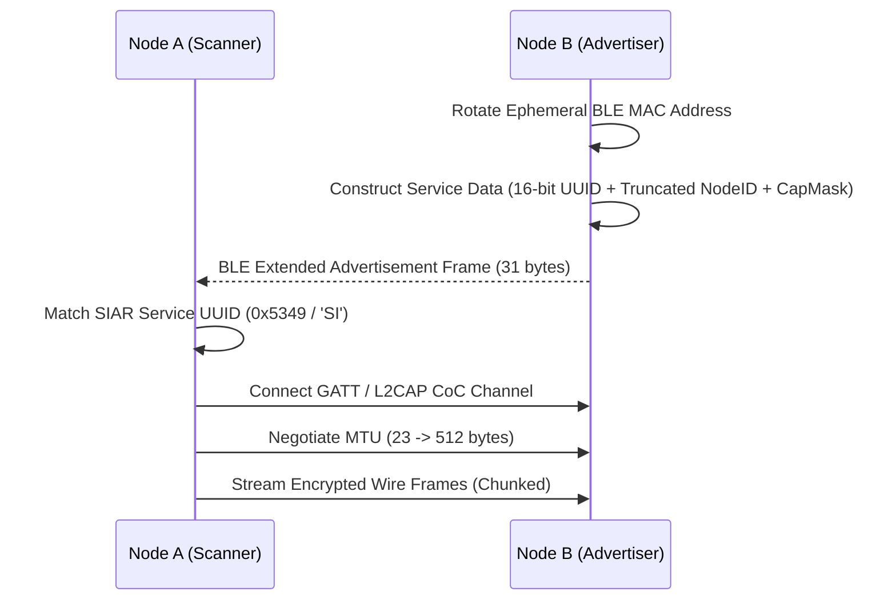

# 05 — Proximity & Hardware Transports

> **Corresponding Specifications:** [`sys-arch/14-proximity-abstraction-architecture.md`](../sys-arch/14-proximity-abstraction-architecture.md), [`sys-arch/15-qr-nfc-bootstrap-pairing-architecture.md`](../sys-arch/15-qr-nfc-bootstrap-pairing-architecture.md)  
> **Key Crates:** [`crates/siar-transport-ble`](../crates/siar-transport-ble), [`crates/siar-transport-bluetooth-classic`](../crates/siar-transport-bluetooth-classic), [`crates/siar-transport-wifi-direct`](../crates/siar-transport-wifi-direct), [`crates/siar-transport-wifi-aware`](../crates/siar-transport-wifi-aware), [`crates/siar-transport`](../crates/siar-transport)

---

## 1. Unified Proximity Abstraction

SIAR isolates hardware-specific radio APIs behind a uniform, asynchronous Rust driver trait:

```rust
#[async_trait]
pub trait TransportDriver: Send + Sync {
    fn transport_kind(&self) -> TransportLinkKind;
    async fn start_advertising(&self, beacon: DiscoveryBeacon) -> Result<(), TransportError>;
    async fn stop_advertising(&self) -> Result<(), TransportError>;
    async fn start_discovery(&self) -> Result<Receiver<DiscoveredPeer>, TransportError>;
    async fn connect(&self, endpoint: &TransportEndpoint) -> Result<Box<dyn StreamChannel>, TransportError>;
    async fn listen(&self) -> Result<Receiver<Box<dyn StreamChannel>>, TransportError>;
}
```

---

## 2. Radio Transports Matrix

```
+-------------------------------------------------------------------------------+
| Transport           | Range    | Throughput   | Energy Drain | Setup Latency  |
+---------------------+----------+--------------+--------------+----------------+
| BLE GATT / L2CAP    | 10–50 m  | 50–500 Kbps  | Very Low     | < 200 ms       |
| Bluetooth Classic   | 10–30 m  | 1–2 Mbps     | Low-Medium   | ~ 1.5 s        |
| Wi-Fi Aware (NAN)   | 30–100 m | 5–50 Mbps    | Low-Medium   | < 500 ms       |
| Wi-Fi Direct (P2P)  | 50–150 m | 50–300 Mbps  | Medium-High  | 2–5 s          |
| Local Subnet (LAN)  | Subnet   | 100–1000 Mbps| Very Low     | < 50 ms        |
| Iroh / QUIC Relay   | Global   | 10–500 Mbps  | Variable     | 100–500 ms     |
+-------------------------------------------------------------------------------+
```

---

## 3. Bluetooth Low Energy (BLE) Engine

Implemented in [`siar-transport-ble`](../crates/siar-transport-ble):



### Frame Fragmentation & Reassembly
Because raw BLE GATT packets are constrained by the negotiated MTU (typically 23–512 bytes), [`siar-transport-ble`](../crates/siar-transport-ble) encapsulates higher-level protocol frames in a 4-byte fragmentation header:
- `SeqNo` (u16): Fragment sequence index.
- `TotalFragments` (u8): Total chunks in envelope.
- `Flags` (u8): `0x01` (First), `0x02` (Last), `0x04` (Emergency Priority).

---

## 4. Wi-Fi Direct & Wi-Fi Aware (NAN)

### Wi-Fi Aware (Neighbor Awareness Networking)
- **Zero Group Owner Dependency**: Clusters form autonomously without a single device bearing all the routing burden.
- **Service Discovery**: Nodes discover each other's capability bitmasks *before* establishing an active data connection.
- **Datapath**: Operates on synchronized channel schedules (100ms discovery windows) to conserve battery during background operation.

### Wi-Fi Direct (P2P High-Bandwidth Bursts)
- **Autonomous GO Negotiation**: When transmitting large media blobs or sync batches (>5 MB), nodes establish an ad-hoc Wi-Fi Direct group.
- **Auto-DHCP & Socket Rendezvous**: Assigns private RFC 1918 link-local IPs and spins up a dedicated TCP/QUIC stream.
- **Auto-Teardown**: The link automatically dissolves after 30 seconds of inactivity to eliminate unnecessary battery drain.
