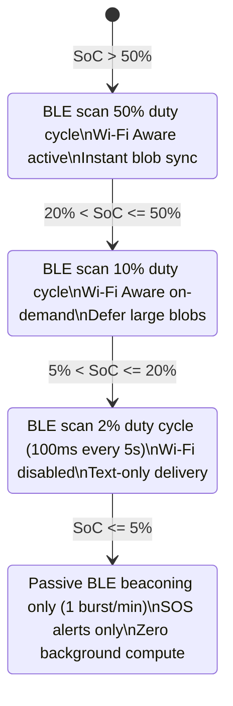
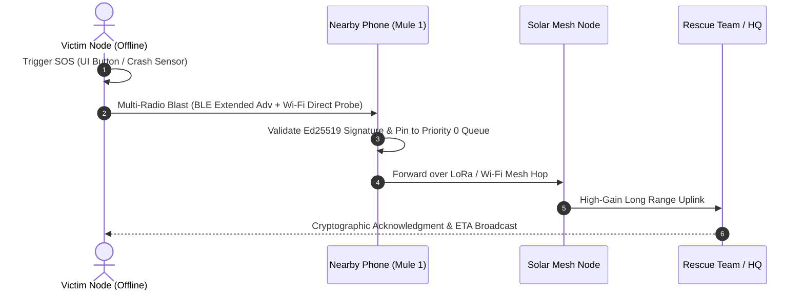

# 07 — Battery-Aware Scheduling & Emergency Mesh

> **Corresponding Specifications:** [`sys-arch/13-battery-aware-scheduling-architecture.md`](../sys-arch/13-battery-aware-scheduling-architecture.md), [`sys-arch/17-emergency-priority-classes-architecture.md`](../sys-arch/17-emergency-priority-classes-architecture.md), [`sys-arch/ui-ux-17-emergency-sos-offline-mesh-architecture.md`](../sys-arch/ui-ux-17-emergency-sos-offline-mesh-architecture.md)  
> **Key Crates:** [`crates/siar-emergency`](../crates/siar-emergency), [`crates/siar-routing-policy`](../crates/siar-routing-policy)

---

## 1. Five-Tier QoS Traffic Priority Engine

SIAR enforces strict quality-of-service traffic classification across all queues, buffers, and radio transmitters:

```
+-------------------------------------------------------------------------------+
| Tier   | Traffic Class             | Preemption | Drop Policy | Transports   |
+--------+---------------------------+------------+-------------+--------------+
| Tier 0 | Emergency SOS Broadcast   | Immediate  | Never Drop  | All Radios   |
| Tier 1 | Realtime Signaling / Voice| High       | Drop on TTL | Wi-Fi / LAN  |
| Tier 2 | Direct 1-on-1 Chat        | Medium     | DTN Spool   | Any Radio    |
| Tier 3 | Group MLS Epoch Commits   | Low        | DTN Spool   | Any Radio    |
| Tier 4 | Blob Sync & Background    | None       | Evict First | Unmetered Net|
+-------------------------------------------------------------------------------+
```

---

## 2. Battery-Aware Duty Cycling Modes

Mobile devices dynamically throttle radio scan intervals, discovery windows, and CPU wakeups according to remaining battery state of charge (SoC):



---

## 3. Emergency SOS Protocol & Mesh Flooding

In disaster scenarios, search-and-rescue operations, or life-safety emergencies, the SOS engine triggers an autonomous epidemic broadcast across every active physical interface:

```rust
pub struct EmergencySosPayload {
    pub emergency_id: EmergencyId,
    pub sender_id: AccountId,
    pub timestamp: Timestamp,
    pub location: Option<GeoCoordinates>, // Latitude, Longitude, Altitude, Accuracy
    pub emergency_type: EmergencyType,    // Medical, Trapped, Fire, NaturalDisaster
    pub battery_remaining_pct: u8,
    pub text_message: Option<String>,
    pub hop_count: u8,
    pub signature: Signature,
}
```



### Invariants of Emergency SOS
1. **Preempts All Queues**: Emergency frames immediately jump to the head of all transmission rings.
2. **Exempt from Duty Cycles**: Devices in `Survival` mode still wake up to receive and relay SOS packets.
3. **No Centralized Key Verification**: Signed with standard Ed25519 identity, decryptable by any authorized responder or public emergency channel.
