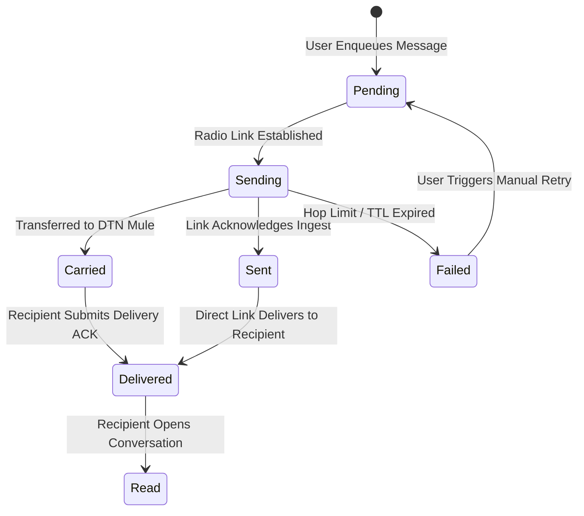

# 08 — Offline Event Log & Outbox Engine

> **Corresponding Specifications:** [`sys-arch/04-offline-event-log-architecture.md`](../sys-arch/04-offline-event-log-architecture.md), [`sys-arch/08-resource-limits-backpressure-architecture.md`](../sys-arch/08-resource-limits-backpressure-architecture.md)  
> **Key Crates:** [`crates/siar-event-log`](../crates/siar-event-log), [`crates/siar-storage`](../crates/siar-storage), [`crates/siar-messaging`](../crates/siar-messaging)

---

## 1. Monotonic Append-Only Event Log Architecture

Every mutation in SIAR (message creation, read receipt, contact verification, profile update, group membership change) is recorded as an immutable event in an append-only log:

```rust
pub struct EventEnvelope {
    pub sequence_number: u64,          // Monotonically increasing per-device sequence
    pub event_id: EventId,             // BLAKE3 hash of payload + metadata
    pub account_id: AccountId,         // Originating author
    pub device_id: DeviceId,           // Originating physical device
    pub timestamp: Timestamp,          // Physical wall-clock time
    pub lamport_clock: u64,            // Logical causal ordering
    pub payload: EventPayload,         // Type-specific event data
    pub signature: Signature,          // Device Ed25519 signature
}
```

```
+-------------------------------------------------------------------------------+
|                       Local Append-Only Event Stream                          |
|  [Seq 1: KeyInit] -> [Seq 2: MsgSent] -> [Seq 3: ReadReceipt] -> [Seq 4: Join]|
+-------------------------------------------------------------------------------+
         |                                  |
         v (Indexed by Cursors)             v (Persisted to Stoolap SQL)
  [Sync Engine to Device B]         [Local App State Views]
```

---

## 2. Outbox Delivery State Machine

When a message or command is initiated while the node is completely offline, it is written to the transactional `OutboxRepo` in [`siar-storage`](../crates/siar-storage):



### State Definitions
- **`Pending`**: Queued in local persistent storage, waiting for an appropriate radio link or transport carrier.
- **`Sending`**: Actively transmitting across one or more physical links.
- **`Carried`**: Transferred to a trusted DTN mule node; local sender retains copy until confirmed delivery.
- **`Delivered`**: Destination node has received, verified, and stored the payload.
- **`Read`**: Destination recipient has focused the conversation view (signed cryptographic read receipt received).

---

## 3. Backoff Retry Engine with Jitter

To prevent channel congestion and radio contention when multiple nodes reconnect simultaneously, [`siar-messaging`](../crates/siar-messaging) implements exponential backoff with randomized full jitter:

$$T_{\text{wait}} = \min\left(T_{\text{max}}, T_{\text{base}} \cdot 2^{\text{attempt}}\right) \times \text{Uniform}(0.5, 1.5)$$

```rust
pub struct RetrySchedule {
    pub base_delay_ms: u64,    // e.g., 500 ms
    pub max_delay_ms: u64,     // e.g., 60,000 ms
    pub max_attempts: u32,     // e.g., 10 attempts before DTN fallback
    pub backoff_factor: f64,   // 2.0
    pub jitter_ratio: f64,     // 0.25 (±25% randomized window)
}
```

---

## 4. Stoolap Embedded SQL Schemas

All message entities, contact trust records, outbox tickets, and sync cursors are persisted locally using **Stoolap**—a zero-dependency, pure-Rust embedded SQL storage engine with zero external C dynamic library requirements:

```sql
CREATE TABLE IF NOT EXISTS messages (
    id TEXT PRIMARY KEY,
    conversation_id TEXT NOT NULL,
    sender_id TEXT NOT NULL,
    recipient_id TEXT,
    content_payload BLOB NOT NULL,
    media_blob_id TEXT,
    delivery_status TEXT NOT NULL,
    created_at INTEGER NOT NULL,
    sequence_no INTEGER NOT NULL
);

CREATE INDEX IF NOT EXISTS idx_messages_conv ON messages(conversation_id, created_at);
CREATE INDEX IF NOT EXISTS idx_messages_status ON messages(delivery_status);
```
