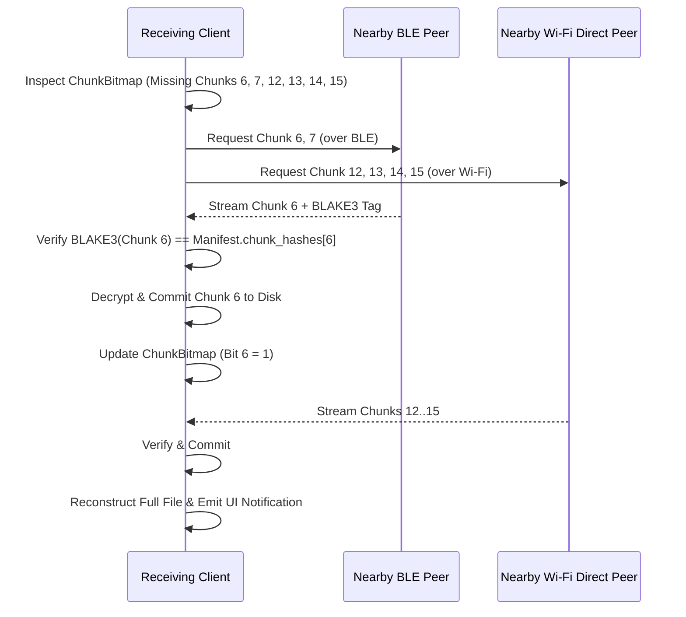

# 09 — Robust Blob Storage & Chunk Transfers

> **Corresponding Specifications:** [`sys-arch/05-robust-file-blob-subsystem-architecture.md`](../sys-arch/05-robust-file-blob-subsystem-architecture.md), [`sys-arch/ui-ux-10-files-media-gallery-transfer-architecture.md`](../sys-arch/ui-ux-10-files-media-gallery-transfer-architecture.md)  
> **Key Crates:** [`crates/siar-blob-manifest`](../crates/siar-blob-manifest), [`crates/siar-storage`](../crates/siar-storage)

---

## 1. Content-Addressed Merkle Blob Architecture

Large files (photos, audio recordings, documents, offline maps, firmware updates) are stored and transferred using **BLAKE3 Merkle Tree Manifests**:

```
                              [BlobId: Root Hash]
                                     /    \
                       [Node Hash 0]        [Node Hash 1]
                          /      \             /      \
                      [Leaf 0] [Leaf 1]    [Leaf 2] [Leaf 3]
                        |         |          |         |
                      [64 KiB] [64 KiB]    [64 KiB] [64 KiB]
```

### Blob Manifest Structure
Implemented in [`siar-blob-manifest`](../crates/siar-blob-manifest):

```rust
pub struct BlobManifest {
    pub blob_id: BlobId,                  // Merkle Tree Root Hash
    pub total_size_bytes: u64,            // Total uncompressed payload size
    pub chunk_size_bytes: u32,            // Default 65,536 bytes (64 KiB)
    pub total_chunks: u32,                // Number of discrete chunks
    pub mime_type: String,                // e.g. "image/avif", "audio/opus"
    pub chunk_hashes: Vec<blake3::Hash>,  // List of all leaf BLAKE3 hashes
    pub encryption_iv: [u8; 12],          // Initialization vector for AEAD
    pub signature: Signature,             // Publisher Ed25519 signature
}
```

---

## 2. Resumable Chunk Bitmaps & Swarm Transfers

Transfer progress is tracked using compact bitsets (`ChunkBitmap`), allowing transfers to be paused, resumed across reboots, or pulled simultaneously from multiple nearby mesh peers:

```
Chunk Map: [ 1 1 1 1 | 1 1 0 0 | 0 0 1 1 | 0 0 0 0 ]  (8/16 Chunks Complete - 50%)
              ^ Peer A    ^ Missing   ^ Peer B   ^ Not started
```



---

## 3. Convergent AEAD Chunk Encryption

To guarantee privacy while still enabling physical mules to deduplicate identical payloads:
1. Each 64 KiB chunk $C_i$ is encrypted with ChaCha20-Poly1305.
2. The chunk key $K_i$ is derived from its plaintext hash: $K_i = \text{HKDF}(\text{BLAKE3}(C_i))$.
3. Intermediate relay nodes can verify the chunk integrity against the Merkle branch without possessing the conversation's master decryption key.

---

## 4. Quota Management & LRU Storage Eviction

To protect embedded flash storage (e.g. Android internal storage or Raspberry Pi SD cards):
- **High-Water Mark (Default 4 GB)**: When blob storage exceeds the configured threshold, background pruning activates.
- **LRU Priority**:
  1. Thumbnails and cached group media older than 30 days are purged first.
  2. Direct 1-on-1 media attachments are retained until user explicitly deletes them.
  3. Emergency SOS attachments are **strictly pinned** and never automatically evicted.
