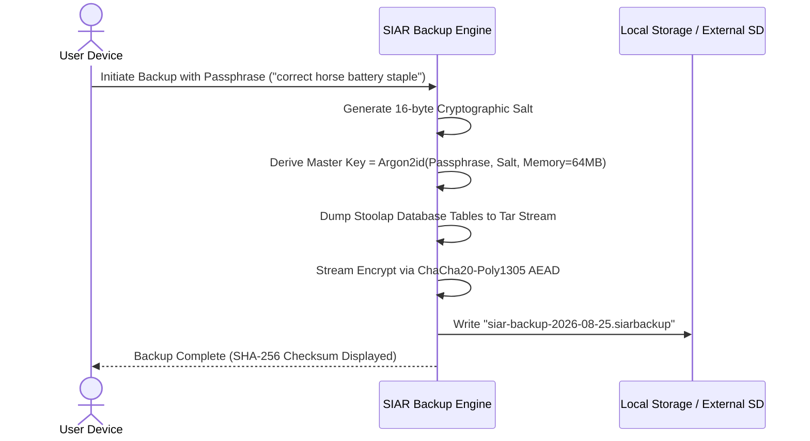

# 10 — Crash Recovery & Data Portability

> **Corresponding Specifications:** [`sys-arch/09-crash-recovery-architecture.md`](../sys-arch/09-crash-recovery-architecture.md), [`sys-arch/33-backup-restore-export-import-archival-portability-architecture.md`](../sys-arch/33-backup-restore-export-import-archival-portability-architecture.md), [`sys-arch/ui-ux-16-backup-restore-export-migration-architecture.md`](../sys-arch/ui-ux-16-backup-restore-export-migration-architecture.md)  
> **Key Crates:** [`crates/siar-storage`](../crates/siar-storage), [`crates/siar-crypto`](../crates/siar-crypto)

---

## 1. Write-Ahead Logging (WAL) & Crash Consistency

Mobile devices frequently face sudden power loss, low-memory process kills (Android OOM killer), and OS hard crashes. SIAR's storage subsystem enforces strict crash-consistency invariants:

```
[Incoming State Mutation]
           |
           v
[Append to Write-Ahead Log (WAL)]  ---> (fsync barrier)
           |
           v
[Apply to In-Memory Stoolap Tables]
           |
           v
[Checkpoint / Flush to Disk Pages] ---> (Periodic / Clean Shutdown)
```

### Crash Recovery Boot Sequence
1. **Journal Replay**: On engine startup, the system scans the WAL for uncheckpointed transactions.
2. **Atomic Roll-Forward**: Completed transactions with valid checksums are applied to primary tables.
3. **Orphaned Chunk Pruning**: Incomplete blob chunk writes from interrupted transfers are automatically detected and staged for resumption without corrupting the existing database.

---

## 2. Encrypted Backup Export (.siarbackup)

SIAR provides sovereign, zero-knowledge archival export. The resulting archive contains the complete encrypted identity, cryptographic key material, contact trust stores, and message history:

```
+-------------------------------------------------------------------------------+
|                        SIAR Encrypted Archive Header                          |
|  - Magic Header: "SIAR_BAK_V1" (12 bytes)                                     |
|  - Argon2id Salt (16 bytes) + KDF Parameters (Memory: 64MB, Iterations: 4)   |
|  - AEAD Nonce (12 bytes)                                                      |
+-------------------------------------------------------------------------------+
|                      Encrypted Payload (ChaCha20-Poly1305)                    |
|  - Stoolap DB Database Dump (SQL dump or binary SQLite/Stoolap stream)        |
|  - Merkle Blob Store Root & Manifest Index                                    |
|  - Identity Root Certificates & Encrypted Private Keystore                    |
+-------------------------------------------------------------------------------+
|                      BLAKE3 Authentication Tag (16 bytes)                     |
+-------------------------------------------------------------------------------+
```



---

## 3. Direct Peer-to-Peer Device Migration

When upgrading to a new phone or laptop, users can migrate their complete account and message database directly over local Wi-Fi Direct or high-speed BLE without cloud intermediaries:

1. **Authentication**: New device generates an ephemeral key; old device scans pairing QR code.
2. **Channel Encryption**: Ephemeral X25519 handshake derives a one-time TLS/Iroh direct tunnel.
3. **P2P Streaming**: Old device streams compressed, encrypted database snapshots and media blobs directly to the new device with real-time transfer progress.
4. **Instant Handoff**: Once verified, the new device activates generation $N+1$ certificate, and the old device transitions to secondary status.
