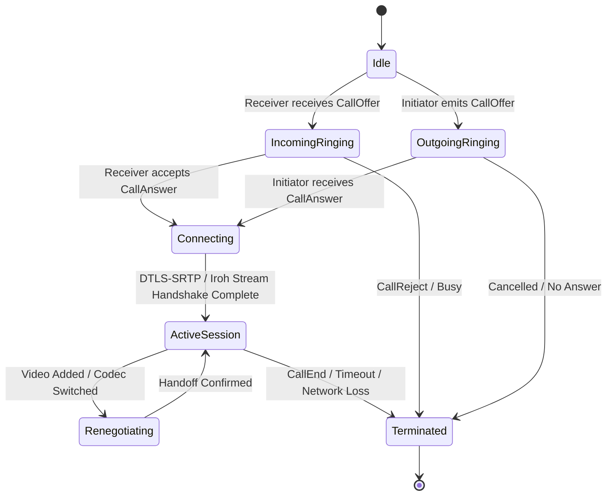
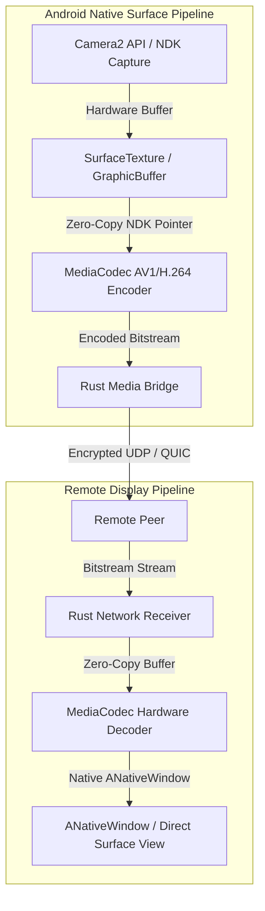

# 11 — Realtime Audio & Video Calling Architecture

> **Corresponding Specifications:** [`sys-arch/25-android-direct-hardware-surface-zero-copy-media-architecture.md`](../sys-arch/25-android-direct-hardware-surface-zero-copy-media-architecture.md), [`sys-arch/26-rust-first-audio-dsp-resampling-aec-ns-agc-architecture.md`](../sys-arch/26-rust-first-audio-dsp-resampling-aec-ns-agc-architecture.md), [`sys-arch/29-realtime-calls-media-session-protocol-architecture.md`](../sys-arch/29-realtime-calls-media-session-protocol-architecture.md), [`sys-arch/ui-ux-07-calls-realtime-media-architecture.md`](../sys-arch/ui-ux-07-calls-realtime-media-architecture.md)  
> **Key Crates:** [`crates/siar-calls`](../crates/siar-calls), [`crates/siar-media-core`](../crates/siar-media-core), [`crates/siar-media-audio`](../crates/siar-media-audio), [`crates/siar-media-av1`](../crates/siar-media-av1), [`crates/siar-media-android`](../crates/siar-media-android)

---

## 1. Realtime P2P Signaling State Machine

Realtime voice and video sessions in SIAR operate over direct P2P transport links (LAN, Wi-Fi Direct, Iroh QUIC) using a lightweight binary signaling protocol in [`siar-calls`](../crates/siar-calls):



---

## 2. Audio DSP Pipeline: AEC, NS, AGC & Opus

The audio subsystem in [`siar-media-audio`](../crates/siar-media-audio) processes microphone input through a real-time digital signal processing pipeline:

```
[Microphone Audio 48 kHz]
           |
           v
[Acoustic Echo Cancellation (AEC)] <--- [Speaker Reference Channel]
           |
           v
[Noise Suppression (NS - Spectral Subtraction)]
           |
           v
[Automatic Gain Control (AGC - Dynamic Range Compression)]
           |
           v
[Voice Activity Detector (VAD)] ---> (Silence Suppression / DTX)
           |
           v
[Opus Encoder (6–64 Kbps VBR)] ---> [Network Packetizer]
```

### Audio Capabilities
- **Sample Rate**: 48,000 Hz high-fidelity stereo or mono voice.
- **Dynamic Bitrate**: 8 Kbps (low-bandwidth emergency mesh) to 64 Kbps (crystal-clear HD call).
- **Packet Loss Concealment (PLC)**: Generates synthetic pitch-period waveforms when isolated network packets drop.

---

## 3. Video Pipeline: AV1 Codec & Zero-Copy Hardware Rendering

SIAR selects the **AV1** video standard for maximum compression efficiency over bandwidth-constrained mesh and wireless links:



### Zero-Copy Advantage
By binding Android NDK `ANativeWindow` pointers directly to the hardware decoding pipeline, frames are rendered straight into the GPU framebuffer without copying multi-megabyte uncompressed pixel buffers through the Java/Kotlin garbage-collected heap.

---

## 4. Adaptive Jitter Buffer & Congestion Control

The `AdaptiveJitterBuffer` continuously estimates network delay variance:
- **Delay Adaptation**: Automatically expands buffer depth during bursty latency spikes and contracts during smooth transmission to minimize end-to-end mouth-to-ear delay ($< 150\text{ms}$ target).
- **BBR Congestion Feedback**: Dynamically signals the AV1 encoder to adjust resolution ($720p \rightarrow 480p \rightarrow 240p$) and frame rate ($30\text{fps} \rightarrow 15\text{fps}$) before packet drops occur.
