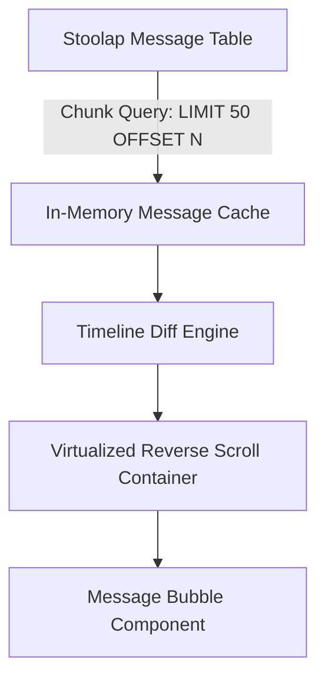

# 13 — Messaging Timeline, Composer & Inbox

> **Corresponding Specifications:** [`sys-arch/ui-ux-04-conversation-list-inbox-architecture.md`](../sys-arch/ui-ux-04-conversation-list-inbox-architecture.md), [`sys-arch/ui-ux-05-conversation-message-timeline-architecture.md`](../sys-arch/ui-ux-05-conversation-message-timeline-architecture.md), [`sys-arch/ui-ux-06-message-composer-attachments-voice-notes-drafts-architecture.md`](../sys-arch/ui-ux-06-message-composer-attachments-voice-notes-drafts-architecture.md)  
> **Key Crates:** [`crates/siar-ui-state`](../crates/siar-ui-state), [`crates/siar-messaging`](../crates/siar-messaging)

---

## 1. Inbox & Conversation List Architecture

The SIAR inbox indexes direct 1-on-1 chats, MLS encrypted groups, and emergency broadcast feeds:

```
+-------------------------------------------------------------------------------+
| [Search Conversations / Transports]                      [+ New Chat / Group] |
+-------------------------------------------------------------------------------+
| [*] Emergency SOS Alert Hub     (3 active broadcasts nearby)      [12:42] (3) |
| [o] Alice Smith                 [BLE Direct] Hey, are you safe?   [12:40] (1) |
| [o] Field Rescue Team Bravo     [Mesh Mule] Checkpoint B reached  [12:35]     |
| [ ] Charlie (Offline)           [DTN Spray] Voice note (0:42)     [11:15]     |
| [ ] Logistics & Supply Channel  [LAN Relay] Supplies in route     [Yesterday] |
+-------------------------------------------------------------------------------+
```

### Transport Path Badges
Every conversation item displays real-time transport route indicators:
- 🟢 **Direct Local**: Connected over sub-10ms BLE, Wi-Fi Direct, or LAN.
- 🟡 **Multi-Hop Mesh**: Reachable via intermediate peer hops ($N$ hops away).
- 🟣 **DTN Mule Transit**: Message carried asynchronously by moving mules.
- 🔵 **Internet Relay**: Reachable over encrypted Iroh/QUIC cloud tunnel.

---

## 2. Virtualized Message Timeline

To render timelines with $> 500,000$ messages smoothly at 60–120 fps with negligible memory consumption, SIAR uses a virtualized reverse windowing model:



### Delivery Status Indicators

| Visual Glyph | Meaning | Underlying Engine State |
| :---: | :--- | :--- |
| 🕒 | **Pending** | Queued in local outbox, awaiting physical radio link |
| ⬆️ | **Transmitting** | Actively sending fragments over radio driver |
| 🎒 | **Mule Carried** | Transferred to trusted DTN carrier node |
| ✓ | **Sent / Stored** | Delivered to direct peer or mesh gateway |
| ✓✓ | **Delivered** | Reached recipient device and committed to storage |
| 👁️ (Blue) | **Read** | Recipient has rendered conversation view |
| ⚠️ | **Failed** | Hop limit exceeded or cryptographic verification error |

---

## 3. Message Composer & Voice Notes

The composer subsystem provides rich multimodal interaction with instant local feedback:

```
+-------------------------------------------------------------------------------+
| [ + Attachment ] [ Type encrypted message...                      ] [ 🎤 Hold ]|
+-------------------------------------------------------------------------------+
| Draft auto-saved • Enter to Send • Shift+Enter for New Line • Max size: 50 MB |
+-------------------------------------------------------------------------------+
```

### Voice Note Recording Pipeline
1. **Low-Latency Capture**: High-definition microphone audio capture at 48 kHz.
2. **Realtime Waveform Preview**: Calculates 60-band audio energy levels every 20ms for dynamic visual waveform rendering.
3. **On-the-Fly Opus Compression**: Encodes directly to Opus bitstream during recording, eliminating post-recording compression delays.
4. **Instant Encryption**: Encrypts and enqueues the resulting blob manifest the moment the user releases the record button.
