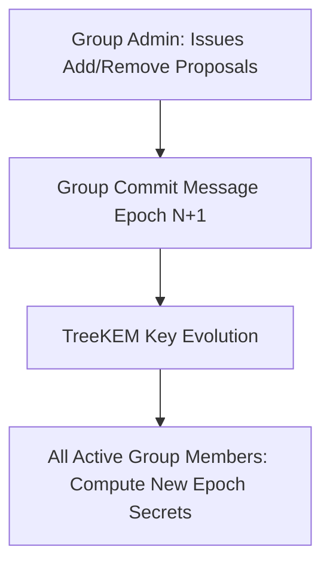

# 14 — Contacts, Groups & Security Center

> **Corresponding Specifications:** [`sys-arch/ui-ux-08-contacts-requests-verification-identity-architecture.md`](../sys-arch/ui-ux-08-contacts-requests-verification-identity-architecture.md), [`sys-arch/ui-ux-09-groups-membership-roles-architecture.md`](../sys-arch/ui-ux-09-groups-membership-roles-architecture.md), [`sys-arch/ui-ux-15-security-center-devices-keys-recovery-architecture.md`](../sys-arch/ui-ux-15-security-center-devices-keys-recovery-architecture.md)  
> **Key Crates:** [`crates/siar-identity-multidevice`](../crates/siar-identity-multidevice), [`crates/siar-crypto-mls`](../crates/siar-crypto-mls), [`crates/siar-ui-state`](../crates/siar-ui-state), [`apps/desktop`](../apps/desktop)

---

## 1. Contact Trust Model & Verification

Contacts in SIAR are cryptographically identified by their Ed25519 `AccountId` and classified into four verification tiers:

```
[New Contact Discovered / Received Message]
                     |
                     v
             +---------------+
             |  Unverified   | ---> Default state; warning banner displayed
             +-------+-------+
                     |
       +-------------+-------------+
       | (SAS 6-digit match or QR) | (Revocation tombstone received)
       v                           v
+---------------+          +---------------+
|   Verified    |          |    Revoked    |
+---------------+          +---------------+
```

### Verification Methods
1. **Safety Number (SAS 6-Digit Code)**: Two peers compare a numeric string (`"842 193"`) or 3-word emoji set derived from their mutual identity keys.
2. **Dynamic QR Code Scan**: Users scan each other's visual contact QR codes during in-person rendezvous.
3. **Hardware NFC Tap**: Fast touch verification between two smartphones.

---

## 2. MLS Group Architecture & Role Management

Group chats are powered by **IETF Messaging Layer Security (MLS)**:



### Group Permission Matrix

| Capability | Group Admin | Standard Member | Read-Only Observer |
| :--- | :---: | :---: | :---: |
| **Send Encrypted Messages** | Yes | Yes | No |
| **Attach Files / Media** | Yes | Yes | No |
| **Invite New Members** | Yes | Optional (Policy) | No |
| **Remove / Kick Members** | Yes | No | No |
| **Update Group Title/Avatar** | Yes | Optional | No |
| **Trigger Epoch Ratchet** | Yes | Yes | No |

---

## 3. Security Center & Device Lifecycle (`ui-ux-15`)

The **Security Center** interface (`siar-ui-state` + `apps/desktop` `SecurityEventsScreen` and `DevicesScreen`) gives users total sovereignty over their cryptographic perimeter:

```
+-------------------------------------------------------------------------------+
|                             SIAR Security Center                              |
+-------------------------------------------------------------------------------+
| [ Shield: Protected ] All 3 linked devices verified with Root Key             |
|                                                                               |
| Linked Devices:                                                               |
|   📱 Primary Phone (Android 14)       • Gen 1 • Active Now (This device)      |
|   💻 Work Laptop (Linux Dioxus)       • Gen 2 • Active 10 min ago             |
|   📟 Emergency Field Node (RPi Zero)  • Gen 3 • Mesh Relay Node   [Revoke]    |
|                                                                               |
| Cryptographic Safety:                                                         |
|   🔑 Export 24-Word Recovery Phrase                                           |
|   📦 Generate Encrypted Offline Backup (.siarbackup)                          |
|   🚨 Emergency Account Lockdown (Revoke all secondary devices)                |
+-------------------------------------------------------------------------------+
```

### Key UI/UX-15 Implementation Invariants
1. **Granular Revocation Capabilities (`RevocationCapabilities`)**: Explicitly detects whether a device supports remote wipe/sign-out (`sign_out_copy`). If remote storage cannot be guaranteed wiped (e.g. air-gapped device with local SQLite), the UI displays an explicit non-erasable local database warning.
2. **Recovery Scopes (`RecoveryScope`)**: Clearly demarcates what cold recovery restores (Identity, Keys, Group memberships) versus what is lost (unrestorable ephemeral local history without prior backup).
3. **Compromise Response Checklist**: Step-by-step guided recovery flow including:
   - Device ejection & tombstone generation
   - Re-verification of affected contacts (`ReVerifyAffectedContacts`)
   - Instant fresh encrypted backup creation (`CreateFreshBackup`)
4. **Emergency Account Lockdown**:
   - Primary device signs a global `RevocationTombstone` for all secondary `DeviceId`s.
   - Broadcast across all mesh and relay links at **Priority 0 (Life-Safety)**.
   - Compromised devices are immediately evicted from all MLS groups and sessions.
