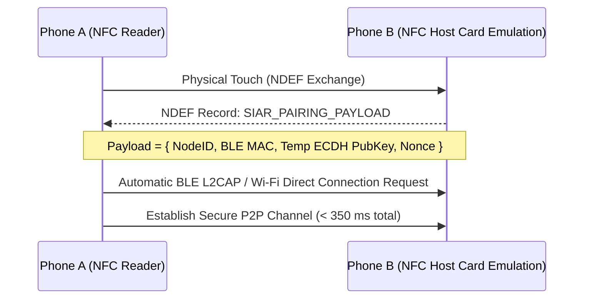

# 15 — Nearby Discovery & Out-of-Band Pairing

> **Corresponding Specifications:** [`sys-arch/ui-ux-12-nearby-qr-nfc-pairing-device-linking-architecture.md`](../sys-arch/ui-ux-12-nearby-qr-nfc-pairing-device-linking-architecture.md), [`sys-arch/15-qr-nfc-bootstrap-pairing-architecture.md`](../sys-arch/15-qr-nfc-bootstrap-pairing-architecture.md)  
> **Key Crates:** [`crates/siar-transport-ble`](../crates/siar-transport-ble), [`crates/siar-connectivity`](../crates/siar-connectivity)

---

## 1. Out-of-Band Zero-Trust Rendezvous

In untrusted environments, establishing initial communication channels over untrusted public networks exposes users to man-in-the-middle (MITM) attacks. SIAR uses physical out-of-band channels for initial contact exchange and device pairing:

```
[Device A: Initiator]                      [Device B: Responder]
        |                                          |
        +======== [1. NFC Tap / Touch] ===========>+ (Instant payload transfer)
        |                                          |
        +======== [2. Dynamic Animated QR] =======>+ (Camera optical scan)
        |                                          |
        +======== [3. BLE Proximity Radar] =======>+ (Sub-second radio link)
```

---

## 2. Animated Fountain QR Codes (UR Standard)

When transferring cryptographic key bundles, device certificates, or offline contact cards that exceed the single-frame density of static QR codes ($> 300\text{ bytes}$), SIAR uses **Animated Uniform Resource (UR) Fountain Codes**:

```
Frame 1/4 (250 B) ---> Frame 2/4 (250 B) ---> Frame 3/4 (250 B) ---> Frame 4/4 (250 B)
         \                      |                      /
          +---------------------+---------------------+
                                |
                                v
               [Camera Lens: 15 FPS Video Stream]
                                |
                                v
             [Fountain Decoder: Reconstructs Payload]
```

### Advantages of Fountain QRs
- **Zero Internet Required**: Transmits full identity certificates completely optically.
- **Error-Tolerant**: Dropped video frames do not break the transfer; the Luby Transform reconstructs the payload once sufficient distinct chunks are captured.
- **Universal Compatibility**: Works across any standard smartphone camera or laptop webcam.

---

## 3. NFC Bootstrap Handshake

For devices with NFC hardware (Android smartphones, contactless card readers):



---

## 4. Visual Proximity Radar UI

The mobile and desktop applications feature a real-time **Mesh Radar** view:

```
                       .  :  *  :  .
                   . '       |       ' .
                 '           |           '
               /      (•) Peer Charlie     \
              |   (-62 dBm, Wi-Fi Aware)    |
              |              |              |
              |              * [You]        |
              |                             |
               \      (•) Peer Bob         /
                 '  (-84 dBm, BLE Mesh)  '
                   . '       |       ' .
                       '  :  *  :  .
```

- **Interactive Nodes**: Tapping a discovered node opens an instant peer inspection modal showing supported capabilities (Text, Audio Call, Video Call, DTN Mule).
- **One-Tap Link**: Initiates an ephemeral encrypted session with a single tap.
