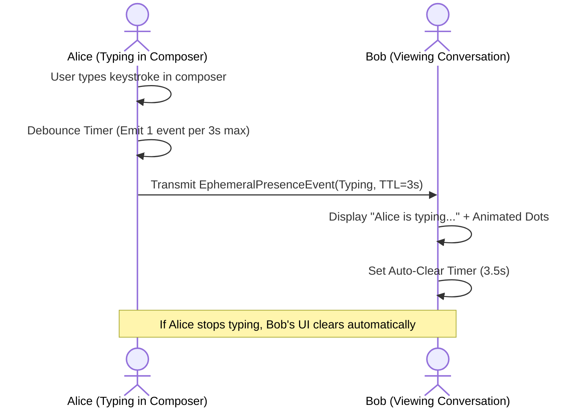

# 16 — Notifications, Presence & Background Lifecycle

> **Corresponding Specifications:** [`sys-arch/30-presence-availability-typing-read-receipts-ephemeral-state-architecture.md`](../sys-arch/30-presence-availability-typing-read-receipts-ephemeral-state-architecture.md), [`sys-arch/31-notifications-push-background-delivery-lifecycle-architecture.md`](../sys-arch/31-notifications-push-background-delivery-lifecycle-architecture.md), [`sys-arch/ui-ux-13-notifications-background-incoming-call-architecture.md`](../sys-arch/ui-ux-13-notifications-background-incoming-call-architecture.md), [`sys-arch/ui-ux-14-presence-typing-receipts-status-architecture.md`](../sys-arch/ui-ux-14-presence-typing-receipts-status-architecture.md)  
> **Key Crates:** [`crates/siar-ui-state`](../crates/siar-ui-state), [`crates/siar-messaging`](../crates/siar-messaging)

---

## 1. Ephemeral Presence & Typing Engine

Unlike persistent chat messages that are stored in the database, typing indicators and active presence are **ephemeral state events** with strict, short-lived time-to-live (TTL) limits:

```rust
pub struct EphemeralPresenceEvent {
    pub account_id: AccountId,
    pub conversation_id: ConversationId,
    pub presence_state: PresenceState,  // Typing, Online, LeftConversation
    pub ttl_ms: u32,                    // Typically 3,000 ms to 5,000 ms
    pub timestamp: Timestamp,
}
```



---

## 2. Privacy-First Presence Matrix

To prevent stalker surveillance and timing analysis:
- **Mutual Contact Invariant**: Presence indicators are only transmitted to contacts explicitly verified and saved in the user's address book.
- **Stealth / Ghost Mode**: Users can toggle "Stealth Mode" at any time. When enabled, the local node receives mesh traffic normally but emits zero presence or typing broadcasts.
- **Coarse Mesh Status**: Nodes in mesh range show as `"Nearby on Mesh"` rather than precise GPS coordinates or real-time IP addresses.

---

## 3. Background Delivery Lifecycle & Mobile Power Management

Keeping radios listening in the background while complying with aggressive OS battery management (Android Doze, iOS background app refresh) requires a multi-tier strategy:

```
[System State: Screen Off / Deep Doze]
                 |
                 v
+---------------------------------------------------------------+
|                Android Persistent Foreground Service          |
|  - Holds partial WakeLock only during active mesh bursts      |
|  - Low-power BLE Extended Advertising (Scan cycle: 100ms/5s)  |
|  - Wi-Fi Direct socket listeners maintained via native epoll  |
+-------------------------------+-------------------------------+
                                |
               +----------------+----------------+
               | (Internet Available)            | (Pure Off-Grid Mesh)
               v                                 v
   [UnifiedPush / WebPush Gateway]     [Direct BLE / Mesh Radio Wake]
               |                                 |
               +----------------+----------------+
                                |
                                v
                [Local Notification Raised in OS]
```

### Incoming Call Full-Screen Wakeup
When an incoming voice/video call signaling offer arrives:
1. The native Rust engine triggers the Android `CallStyle` high-priority notification.
2. The phone screen illuminates with full-screen incoming call UI, ringtone, and vibration pattern even if the device was in deep sleep.
3. If the user accepts, the audio DSP hardware immediately connects without cold-starting the full application.
