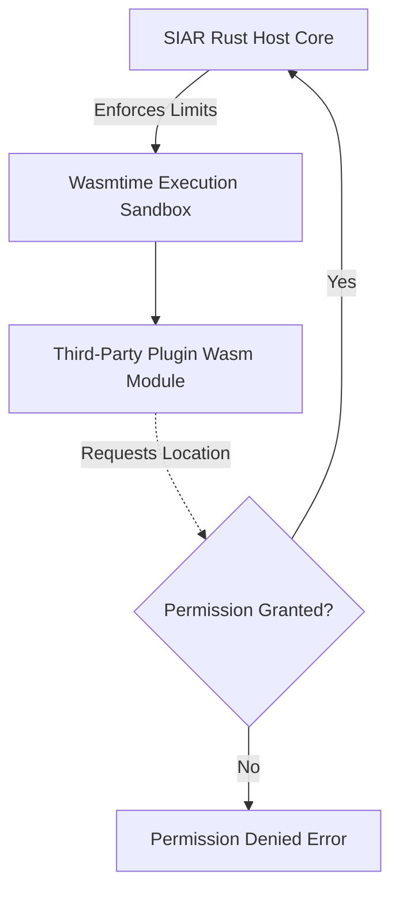

# 18 — Protocol Extensions & WASM Plugins

> **Corresponding Specifications:** [`sys-arch/01-protocol-extension-system-architecture.md`](../sys-arch/01-protocol-extension-system-architecture.md), [`sys-arch/21-third-party-protocol-extensions-architecture.md`](../sys-arch/21-third-party-protocol-extensions-architecture.md), [`sys-arch/22-wasm-compatible-components-architecture.md`](../sys-arch/22-wasm-compatible-components-architecture.md), [`sys-arch/24-plugin-module-ecosystem-architecture.md`](../sys-arch/24-plugin-module-ecosystem-architecture.md), [`sys-arch/ui-ux-19-plugin-module-ecosystem-architecture.md`](../sys-arch/ui-ux-19-plugin-module-ecosystem-architecture.md)  
> **Key Crates:** [`crates/siar-protocol-ext`](../crates/siar-protocol-ext), [`crates/siar-protocol`](../crates/siar-protocol)

---

## 1. Dynamic Protocol Extension Architecture (Part 01 — 108/108 Spec Complete)

The SIAR protocol extension engine ([`crates/siar-protocol-ext`](../crates/siar-protocol-ext)) is **108/108 sections complete**, providing a hardened, production-ready framework for dynamic protocol extensions:

```rust
pub struct ExtensionDescriptor {
    pub extension_id: ExtensionId,        // e.g. "org.siar.gis.tactical-map"
    pub version: ExtensionVersion,        // SemVer compliant versioning
    pub author_signature: Signature,      // Ed25519 publisher signature
    pub required_capabilities: CapabilityBitmask,
    pub permissions: Vec<PluginPermission>, // StorageAccess, LocationAccess, NetworkAccess
}
```

```
+-------------------------------------------------------------------------------+
|                         Standard SIAR Wire Frame                              |
|  - Magic Header + Frame Length + Version + Ephemeral Routing Token            |
+-------------------------------------------------------------------------------+
|                       Extension Envelope (Dynamic Tag)                        |
|  - Extension ID: 0x474953 ("GIS")  - Extension Version: 0x010200              |
|  - Typed Binary Payload (Protobuf / Postcard / Raw Bytes)                     |
+-------------------------------------------------------------------------------+
```

### Core Architectural Subsystems in `siar-protocol-ext`
1. **Weighted Fair Queue Scheduler (`FairScheduler`, `BoundedQueue`)**: Enforces bounded resource usage and fair queueing across concurrently registered protocol extensions, preventing any single extension from monopolizing network bandwidth or buffer memory.
2. **Health Monitoring & Fault Recovery (`health.rs`, `violation.rs`)**: Real-time error taxonomy tracking runtime violations, automatically isolating unhealthy extension handlers and shedding load under memory pressure.
3. **Capability & State Isolation (`isolation.rs`)**: Strictly isolates per-extension state stores and ensures extensions cannot tamper with core routing tables or cryptographic key envelopes.
4. **Deprecation & Version Migration Engine (`deprecation.rs`)**: Structured deprecation lifecycles with sunset timestamps, warning grace periods, and backward-compatibility fallbacks.
5. **Definition of Done Self-Audit (`definition_of_done.rs`)**: Built-in 16-point architectural verification matrix embedded directly in the crate test suite.

---

## 2. WebAssembly (WASM) Sandbox Runtime

Third-party plugin code runs in a sandboxed WebAssembly execution environment with strict hardware boundaries:



### Sandbox Security Invariants
1. **Instruction / Fuel Limiting**: Each plugin execution is granted a finite fuel budget (e.g. 5,000,000 instructions) to prevent infinite loops and denial-of-service hangs.
2. **Strict Memory Quotas**: Linear memory is capped (maximum 32 MB per plugin instance).
3. **No Direct OS Syscalls**: Plugins have zero direct access to filesystem, raw network sockets, or hardware devices; all I/O occurs via audited host function bindings.

---

## 3. Plugin Lifecycle & Marketplace Distribution

- **Self-Contained Bundles (`.siarplugin`)**: A signed ZIP archive containing the compiled `plugin.wasm`, manifest, localized strings, and UI vector icons.
- **Offline Sideloading**: Plugins can be shared peer-to-peer over BLE or Wi-Fi Direct like any regular file attachment.
- **Revocation List**: Compromised or malicious plugin IDs are gossiped via the standard cryptographic tombstone network.
