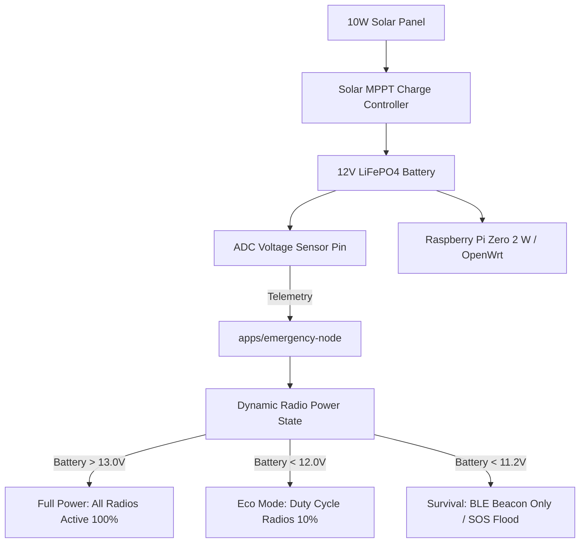

# 19 — Headless Daemons & Embedded Nodes

> **Corresponding Specifications:** [`sys-arch/16-daemon-headless-runtime-architecture.md`](../sys-arch/16-daemon-headless-runtime-architecture.md), [`sys-arch/20-embedded-linux-node-architecture.md`](../sys-arch/20-embedded-linux-node-architecture.md)  
> **Key Applications:** [`apps/emergency-node`](../apps/emergency-node), [`apps/cli`](../apps/cli)

---

## 1. Headless Runtime Architecture

For autonomous relay towers, tactical command posts, and solar-powered wilderness repeaters, SIAR provides headless daemon binaries that operate without any display server or graphical environment:

```
[Hardware Platform: Raspberry Pi / OpenWrt Router / Embedded Linux]
                                 |
                                 v
[SIAR Emergency Node Daemon (apps/emergency-node)]
  - Systemd Service / Init Script
  - In-Memory / Flash Stoolap DB Storage
  - Multi-Radio Packet Forwarder (BLE + Wi-Fi Mesh + Ethernet)
  - Solar Battery Voltage Monitor
```

---

## 2. Solar-Powered Mesh Repeater (`apps/emergency-node`)

The `emergency-node` application is engineered for multi-year maintenance-free deployment in extreme environments:



### Key Daemon Features
- **Zero-Touch Provisioning**: Mounts root filesystem read-only to eliminate SD-card corruption during sudden power drops.
- **Auto-Mesh Peering**: Automatically discovers and links with nearby SIAR smartphones, vehicles, and sister repeaters.
- **Store-and-Forward Cache**: Retains up to 50,000 DTN bundles in persistent flash storage to relay between passing field teams.

---

## 3. Command-Line Interface (`apps/cli`)

The CLI utility provides powerful diagnostics and administrative controls for operators and developers:

```bash
# Start a headless SIAR mesh daemon
$ siar-node daemon --config /etc/siar/node.toml --log-level info

# Display real-time radio link telemetry and active peers
$ siar-cli peers list
ID         TRANSPORT       RSSI     RTT    STATE     CAPABILITIES
----------------------------------------------------------------------
a8f9c1..   BLE_GATT        -68dBm   45ms   Active    [TEXT, DTN, SOS]
3e02b7..   WIFI_DIRECT     -54dBm   8ms    Active    [TEXT, CALL, VIDEO, BLOB]
f1092a..   LAN_MULTICAST   -42dBm   2ms    Active    [ALL]

# Send an urgent off-grid command across the mesh
$ siar-cli send --to a8f9c1.. --priority high --msg "Basecamp logistics update"
[+] Message enqueued to outbox (Seq: 1492) -> Dispatched over WIFI_DIRECT in 12ms.
```
