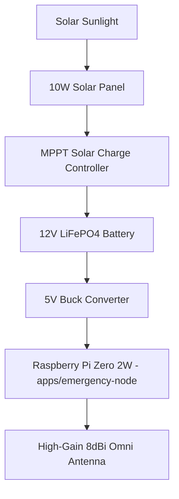

# 23 — Off-Grid Survival & Field Operations Guide

> **Target Audience:** First Responders, Disaster Relief Teams, Wilderness Expeditions, Tactical Operators  
> **Corresponding Guides:** [`docs/off-grid.md`](../docs/off-grid.md), [`sys-arch/ui-ux-17-emergency-sos-offline-mesh-architecture.md`](../sys-arch/ui-ux-17-emergency-sos-offline-mesh-architecture.md)

---

## 1. Disaster Scenario Deployment Playbook

When terrestrial cellular networks, municipal power grids, and Internet services collapse:

```
[Phase 1: Rapid Beaconing (0–30 min)]
  • First responders activate SIAR mobile apps with BLE / Wi-Fi Direct.
  • Immediate local peer discovery without configuring Wi-Fi passwords or hotspots.

[Phase 2: Tactical Mesh Anchor (30–60 min)]
  • Deploy 2–3 solar-powered emergency-node repeaters on high ground / rooftops.
  • Establish long-range line-of-sight relays bridging camps, clinics, and supply depots.

[Phase 3: Asynchronous Mule Backbone (1–24 hours)]
  • Vehicles, drones, and foot patrols carrying SIAR nodes act as DTN mules.
  • Automatic bundle sync occurs whenever mules pass within 100 meters of a node.
```

---

## 2. Solar Repeater Hardware Assembly

```
+-------------------------------------------------------------------------------+
|                      SIAR Tactical Solar Mesh Node (Bill of Materials)        |
+-------------------------------------------------------------------------------+
| 1. Compute:       Raspberry Pi Zero 2 W or Orange Pi Zero 3 ($15–$25)         |
| 2. Power:         10W–20W Monocrystalline Solar Panel + MPPT Solar Controller |
| 3. Battery:       12V 6Ah–10Ah LiFePO4 Battery (Cold/Heat resilient, 3000 cyc)|
| 4. Enclosure:     IP67 Weatherproof Junction Box with Gore-Tex vent           |
| 5. Antenna:       Dual-Band 2.4 GHz / 5.8 GHz High-Gain Omni-directional (8dBi|
+-------------------------------------------------------------------------------+
```



---

## 3. Field Operational Runbooks

### Runbook A: Search-and-Rescue Triage
1. **Search Team Departure**: Field teams carry smartphones running SIAR in `Emergency Network Mode`.
2. **GPS Beaconing**: Devices periodically generate signed location beacons.
3. **Survivor Encounter**:
   - Rescuers scan survivor's SIAR QR code or tap via NFC.
   - Medical triage status (Red/Yellow/Green) and casualty notes are tagged to the identity.
   - The report is broadcast at **Priority 0** across the mesh to notify surgical teams at basecamp.

### Runbook B: High-Interference / Jamming Environments
- Switch to **Low-Frequency BLE Bursting**: Reduces transmission duration to $< 10\text{ms}$ bursts with randomized intervals.
- Enable **Stealth Mode**: Local nodes listen passively to DTN traffic without emitting discoverable beacons.
