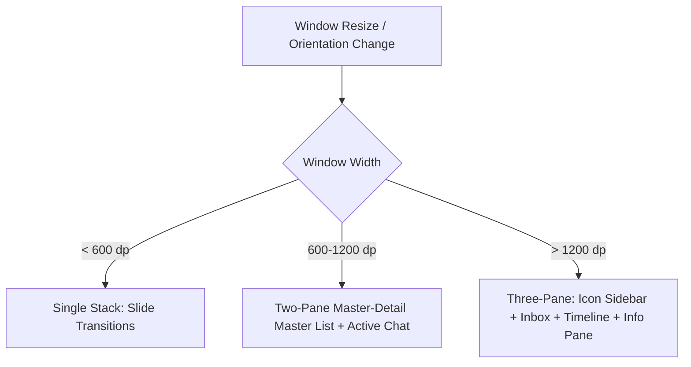

# 25 — Design System Tokens & Responsive Adaptive Layouts

> **Corresponding Specifications:** [`sys-arch/ui-ux-22-design-system-tokens-typography-icons-motion-architecture.md`](../sys-arch/ui-ux-22-design-system-tokens-typography-icons-motion-architecture.md), [`sys-arch/ui-ux-23-responsive-adaptive-desktop-tablet-foldable-phone-layout-architecture.md`](../sys-arch/ui-ux-23-responsive-adaptive-desktop-tablet-foldable-phone-layout-architecture.md)  
> **Key Modules:** [`crates/siar-ui-state`](../crates/siar-ui-state), [`apps/desktop`](../apps/desktop), [`apps/android`](../apps/android)

---

## 1. Unified Cross-Platform Design System Tokens

SIAR enforces a strict design token hierarchy across both the Dioxus Rust desktop GUI and Jetpack Compose Android frontends:

```
[Design Tokens JSON / Rust Constants]
                 |
        +--------+--------+
        |                 |
        v                 v
[Desktop Dioxus CSS]    [Android Material 3 Tokens]
(Variables / Classes)   (ColorScheme / Typography)
```

### Core Token Palette

| Token Category | Token Name | Hex Value / Spec | Usage |
| :--- | :--- | :--- | :--- |
| **Brand Primary** | `color-primary-500` | `#3B82F6` (Electric Blue) | Action buttons, active badges, sender bubbles |
| **Emergency SOS** | `color-emergency-600` | `#DC2626` (Vivid Crimson) | Priority 0 alerts, SOS beaconing triggers |
| **Mesh Active** | `color-mesh-green` | `#10B981` (Emerald Green) | Direct radio link indicators (BLE, Wi-Fi Direct) |
| **Surface Dark** | `color-surface-900` | `#0F172A` (Slate Navy) | App shell background in dark mode |
| **Typography Body** | `font-family-body` | `Inter`, `Roboto`, system-ui | Primary chat bubbles and timeline text |
| **Typography Mono** | `font-family-mono` | `JetBrains Mono`, monospace | SAS security numbers, node IDs, hex hashes |

---

## 2. Responsive & Adaptive Breakpoints

SIAR dynamically reflows its user interface across five distinct device form factors:

```
+-------------------------------------------------------------------------------+
| Device Form Factor      | Width Range    | Layout Strategy                    |
+-------------------------+----------------+------------------------------------+
| Compact Phone           | < 600 dp       | Single-Pane Stack Navigation       |
| Foldable Unfolded       | 600–840 dp     | Two-Pane Split (Inbox + Chat)      |
| Tablet Landscape        | 840–1200 dp    | Two-Pane + Collapsible Details     |
| Desktop Windowed        | 1200–1600 dp   | Three-Pane (Nav + List + Timeline) |
| Ultra-Wide Multi-Monitor| > 1600 dp      | Multi-Inspector Workstation Layout |
+-------------------------------------------------------------------------------+
```



### Adaptive Interaction Invariants
- **Touch Targets**: Minimum $48 \times 48\text{ dp}$ on mobile and touch devices; compact $32\text{ dp}$ with hover states on desktop.
- **Keyboard Shortcuts**: Complete desktop navigation via keyboard (<kbd>Ctrl</kbd>+<kbd>K</kbd> search, <kbd>Ctrl</kbd>+<kbd>1..9</kbd> chat switching, <kbd>Esc</kbd> dismiss).
- **Haptic Feedback**: Contextual haptics on Android for emergency triggers, SAS key verification matches, and outgoing delivery confirmations.
