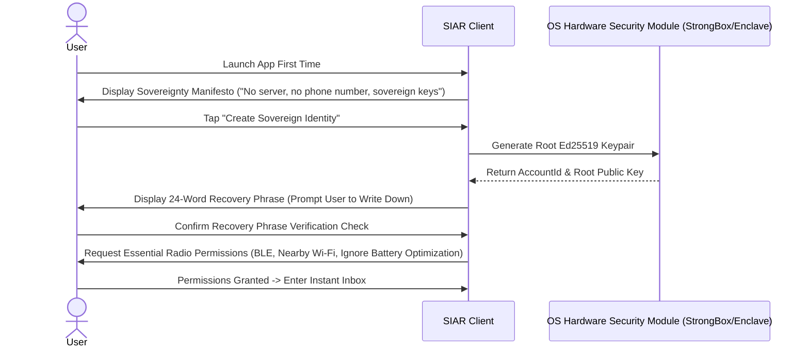

# 26 — UI/UX Performance, Testing & Quality Gates

> **Corresponding Specifications:** [`sys-arch/ui-ux-24-error-loading-empty-offline-degraded-state-architecture.md`](../sys-arch/ui-ux-24-error-loading-empty-offline-degraded-state-architecture.md), [`sys-arch/ui-ux-25-onboarding-first-run-permission-education-architecture.md`](../sys-arch/ui-ux-25-onboarding-first-run-permission-education-architecture.md), [`sys-arch/ui-ux-26-performance-virtualization-large-data-ui-architecture.md`](../sys-arch/ui-ux-26-performance-virtualization-large-data-ui-architecture.md), [`sys-arch/ui-ux-27-ui-testing-screenshot-interaction-release-quality-gates-architecture.md`](../sys-arch/ui-ux-27-ui-testing-screenshot-interaction-release-quality-gates-architecture.md)  
> **Key Modules:** [`crates/siar-ui-state`](../crates/siar-ui-state), [`apps/android`](../apps/android), [`apps/desktop`](../apps/desktop)

---

## 1. Onboarding & First-Run Permission Education

Creating an account in SIAR requires zero phone numbers or cloud accounts. The onboarding wizard guides users through cryptographic sovereignty in three transparent steps:



---

## 2. Empty, Offline & Degraded UI States

The UI explicitly reflects network degradation and offline operation with actionable user cues rather than silent failures or perpetual spinning wheels:

```
+-------------------------------------------------------------------------------+
| [!] Offline Mesh Active — No Internet Relays Reachable                        |
|     Messages are queuing in local Outbox and spraying over nearby BLE radios. |
+-------------------------------------------------------------------------------+
|                                                                               |
|                            [ Empty Inbox Graphic ]                            |
|                          No Active Conversations Yet                          |
|                                                                               |
|   • Tap [Scan Nearby QR] to pair with a colleague's phone                     |
|   • Tap [Discover Nearby Mesh] to detect local radio beacons                  |
|   • Tap [Emergency SOS Hub] to view broadcast life-safety channels            |
|                                                                               |
+-------------------------------------------------------------------------------+
```

---

## 3. 120 FPS Virtualization & Memory Windowing

To maintain 60–120 FPS fluid scrolling even in conversations with $> 250,000$ messages:

```
[In-Memory Virtual Window: 100 Messages Visible]
                    |
      +-------------+-------------+
      |                           |
      v                           v
[Prefetch Buffer: 50 Msgs Up]   [Prefetch Buffer: 50 Msgs Down]
      |                           |
      +-------------+-------------+
                    | (Evict distant chunks from memory)
                    v
         [Stoolap Disk Storage]
```

### Performance Invariants
1. **Zero Heap Allocations in Render Loop**: Frame layout measurements and text shaping caches are recycled across scroll gestures.
2. **Async Image Decoding**: Media attachments are decompressed on background worker threads with GPU texture caching.
3. **Sub-16ms Frame Budget**: All state reductions and UI updates complete well within the $16.6\text{ms}$ frame deadline.

---

## 4. UI Quality Gates & Automated Screenshot Regression Testing

Before any release binary is tagged, the CI pipeline executes automated UI quality gates:

```
+-------------------------------------------------------------------------------+
|                      SIAR UI Release Quality Gates                            |
+-------------------------------------------------------------------------------+
| 1. Screenshot Regression Tests:  Paparazzi snapshot tests match pixel diff <0.1%|
| 2. Accessibility Audits:         100% WCAG 2.1 AA contrast & screen reader tags|
| 3. High-DPI & Font Scaling:     Tested up to 200% system font scaling         |
| 4. Dark & Light Theme Parity:    All tokens verified in both color modes       |
| 5. Zero Crash Stress Test:       10,000 simulated rapid UI touch interactions   |
+-------------------------------------------------------------------------------+
```
