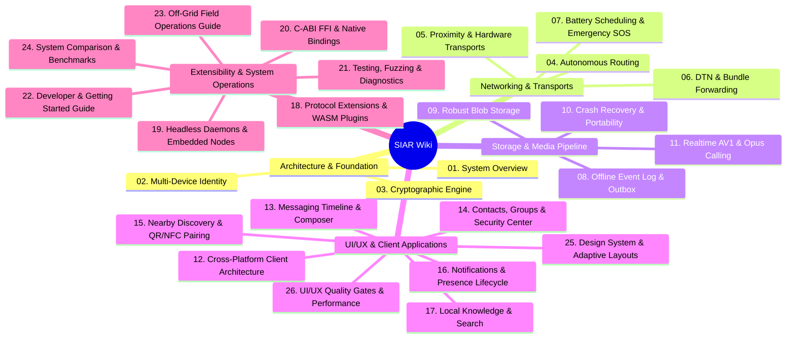

# Welcome to the SIAR Comprehensive Wiki

> **SIAR** (Survivable Identity & Autonomous Routing) is a zero-infrastructure, cryptographically sovereign communication platform engineered for mission-critical resilience, off-grid disaster recovery, and everyday private messaging.

---

## 🧭 Master Wiki Portal & Sitemap

---

## 📚 Table of Contents by Domain

### 🏛️ Part I: Core Architecture, Identity & Cryptography
* **[[01-System-Overview-and-Architecture]]**: High-level design, survivability invariants, workspace topology (33 Rust crates, 4 apps).
* **[[02-Multi-Device-Identity-and-Trust]]**: Ed25519 root authority, monotonic certificates, device tree revocation, SAS out-of-band verification.
* **[[03-Cryptographic-Engine-and-Key-Management]]**: IETF MLS (RFC 9420) tree ratchets, pairwise Double Ratchet, BLAKE3 convergent chunk encryption, post-quantum hybrid KEM roadmap.

### 🌐 Part II: Mesh Networking, Delay-Tolerant Networking (DTN) & Proximity
* **[[04-Autonomous-Routing-and-Policy-Engine]]**: Cost-aware multi-metric scoring, dynamic link health probes, heterogeneous path selection.
* **[[05-Proximity-and-Hardware-Transports]]**: Pure Rust BLE GATT, Bluetooth Classic RFCOMM, Wi-Fi Direct (P2P), Wi-Fi Aware (NAN), multicast LAN rendezvous.
* **[[06-Delay-Tolerant-Networking-and-Bundle-Forwarding]]**: Store-Carry-Forward bundles, Spray-and-Wait replication, custody transfer receipts.
* **[[07-Battery-Aware-Scheduling-and-Emergency-Mesh]]**: Five-tier QoS priority engine, emergency broadcast flood, duty cycle throttling.

### 💾 Part III: Storage Engine, Event Log & Media Pipeline
* **[[08-Offline-Event-Log-and-Outbox-Engine]]**: Monotonic sequence outbox queue, Stoolap SQL storage, outbox delivery state machine.
* **[[09-Robust-Blob-Storage-and-Chunk-Transfers]]**: Merkle DAG content addressing, ChaCha20-Poly1305 chunk encryption, resumable transfers.
* **[[10-Crash-Recovery-and-Data-Portability]]**: Write-ahead logging, transactional atomicity, encrypted backup export/import.
* **[[11-Realtime-Audio-Video-Calling-Architecture]]**: AV1 hardware codec bridge (zero-copy surfaces), Opus DSP (AEC, NS, AGC), P2P signaling state machine.

### 📱 Part IV: UI/UX State, Client Frontends & Mobile Runtimes
* **[[12-Cross-Platform-Client-Architecture]]**: Desktop GUI (Dioxus 0.7 + Rust) and Android Mobile (Jetpack Compose + JNI glue).
* **[[13-Messaging-Timeline-Composer-and-Inbox]]**: Virtualized message timeline, rich attachments, voice note recorder, optimistic UI state.
* **[[14-Contacts-Groups-and-Security-Center]]**: Key verification, MLS group membership management, security center and recovery codes.
* **[[15-Nearby-Discovery-and-Out-of-Band-Pairing]]**: Dynamic QR exchange, NFC bootstrap, zero-configuration local mesh pairing.
* **[[16-Notifications-Presence-and-Background-Lifecycle]]**: Ephemeral presence, typing indicators, push notification triggers, OS background service management.
* **[[17-Local-Knowledge-Retrieval-and-Search]]**: Privacy-first offline BM25 full-text indexing, vector embeddings, local knowledge retrieval.
* **[[25-Design-System-Tokens-and-Responsive-Layouts]]**: Cross-platform design tokens, theme hierarchy, multi-window adaptive layouts.
* **[[26-UI-UX-Performance-Testing-and-Quality-Gates]]**: Onboarding wizards, empty states, 120 FPS virtualization, snapshot regression quality gates.

### ⚙️ Part V: Extensibility, Operations & Benchmarking
* **[[18-Protocol-Extensions-and-WASM-Plugins]]**: Capability negotiation engine, dynamic extension registry, Wasm sandboxing.
* **[[19-Headless-Daemons-and-Embedded-Nodes]]**: Command-line interface, `emergency-node` solar repeater daemon, OpenWrt/Raspberry Pi targets.
* **[[20-C-ABI-FFI-and-Native-Language-Bindings]]**: Zero-copy C-ABI headers, Android JNI glue, memory safety isolation.
* **[[21-Testing-Fuzzing-and-Network-Diagnostics]]**: Simulated multi-hop `siar-testkit`, AFL/cargo-fuzz suites, dynamic path visualizer.
* **[[22-Getting-Started-and-Developer-Guide]]**: Workspace setup, compilation, unit/property testing, coding standards.
* **[[23-Off-Grid-Survival-and-Field-Operations-Guide]]**: Tactical field deployment, solar mesh setups, emergency response playbook.
* **[[24-System-Comparison-and-Benchmarking]]**: Deep architectural comparison: SIAR vs WhatsApp vs Signal vs Matrix vs Briar.

---

## 🚀 Key Architectural Pillars

| Pillar | Architectural Principle | Implementation in SIAR |
| :--- | :--- | :--- |
| **1. Autonomous Survivability** | Zero dependency on centralized servers, DNS, certificates authorities, or cellular backhauls. | `siar-routing`, `siar-dtn`, `siar-transport-*` |
| **2. Multi-Transport Agility** | Seamlessly hop between Internet, LAN, Wi-Fi Direct, Wi-Fi Aware, Bluetooth Classic, and BLE. | `siar-connectivity`, `siar-routing-policy` |
| **3. Cryptographic Sovereignty** | Ed25519 master root keys with multi-device certificate trees and MLS group encryption. | `siar-crypto`, `siar-identity-multidevice`, `siar-crypto-mls` |
| **4. Delay-Tolerant Dissemination** | Messages survive complete network partitions via physical mule carry and hop-by-hop spray forwarding. | `siar-dtn-bundle`, `siar-blob-manifest` |
| **5. Native Rust Performance** | Memory-safe, high-concurrency Rust core with zero-copy JNI and Dioxus desktop UI. | `crates/`, `apps/` |

---

## 🔗 Architecture Specifications Mapping

All wiki chapters map directly to the exhaustive specifications in [`sys-arch/`](file:///home/irshad/Projects/siar/sys-arch):

- **Core Specs 01–33**: Protocol extensions, multi-device identity, transport routing, offline log, blob storage, DTN, capability negotiation, crash recovery, fuzzing, self-hosted relays, multipath, battery scheduling, proximity, QR/NFC pairing, headless runtime, emergency priorities, network diagnostics, FFI, embedded Linux, third-party extensions, WASM, interop, plugin ecosystem, Android zero-copy media, audio DSP, Android build automation, production security, realtime calls, presence state, background notifications, search indexing, and backup portability.
- **UI/UX Specs 01–27**: Product foundations, Dioxus shell, Compose shell, inbox, timeline, composer, calls, contacts, groups, media gallery, search, nearby pairing, notifications, presence, security center, backup migration, SOS offline mesh, settings privacy, plugin ecosystem, diagnostics visualizer, accessibility, design tokens, adaptive layouts, state handling, onboarding education, virtualization performance, and UI quality gates.
